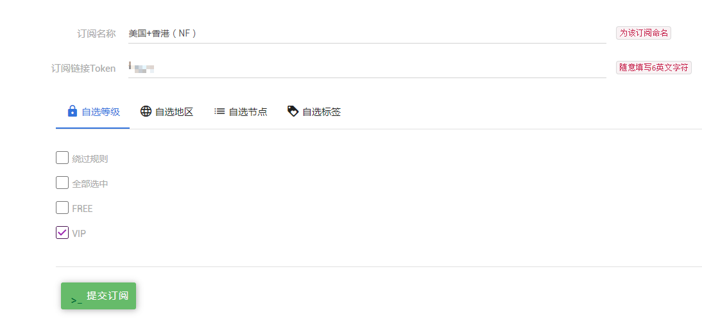

# 定制订阅

## 定制订阅

1.首先前往订阅中心（点击下方进入）

2.点击添加订阅

3.订阅名称自定，Token输入任意6英文字符即可（无需记忆）。

4.选择要筛选出的节点。筛选规则如下：

* 分：自选等级，自选地区，自选节点，自选标签 四个条件。节点必须同时满足您选择的4个条件，才会被筛选出来。
* 如果您不想使用某个条件， 在对应规则选择：**绕过规则** 即可。（例如我不想筛选地区，自选地区选择绕过规则即可）
* 所有规则都必须被选择，不想使用这个规则，就选择绕过规则即可。

5.选择完成后，点击提交订阅即可。

6.然后会自动跳转回订阅中心，点击查看按钮，即可查看订阅地址。


订阅后如果一个节点都没有，代表没有符合您条件的节点。


容易出现的问题：

* 自选地区和自选节点的冲突：比如我自选地区选择香港，自选节点选择美国GIA A，那么意思是要求这个节点必须既是美国GIA A，又必须是香港，这样的节点显然不存在。所以建议，自选地区和自选节点，仅需使用一个，另外一个条件绕过即可，以避免这种冲突。

## 范例

在这举个例子，以帮助您进行定制。

> 例如，我想订阅美国和香港的VIP节点，并且希望它们即可以看Youtube可以看Netflix。

只需要：自选等级选择VIP，自选地区选择美国和香港，自选节点选择绕过，自选标签选择Youtube和Netflix即可。

## 其它

1.您可定制订阅的数量受到限制。这和您选购的套餐有关。您可前往商店，查看不同套餐限制的数量，选购适合您的套餐。

2.如果您的订阅链接泄露了，请点击重置按钮，订阅链接会被更改。但是同时建议您前往[用户资料编辑](http://www.tzct.xyz/user/edit)界面更改连接密码，否则对方虽然不能获得最新配置，但是原有获取的配置却依然可以连接。

