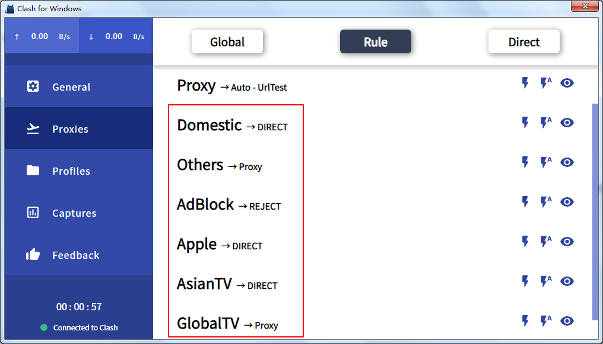
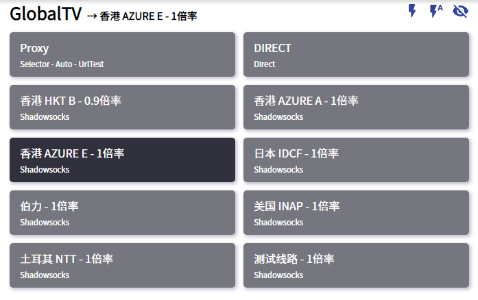

# 策略组

## 前言

在 Clash/Surge/Surfboard 中，我们除了能看见 Proxy这个选项，还能看到很多其他规则（如图）。

下方我们将以Clash for Windows 作为例子，展示这些规则是如何运作的。

## 规则的意义

实际上，每一个规则名字都对应着一些网站列表。我们可以对这些网站进行单独的配置，使其走不同的节点。例如我可以做到百度直连，谷歌走美国节点，Netflix走香港节点。而这可以由程序自主，自动控制。

下面我们将解释各个各个名称的规则，对于哪些网站。

| 规则名称 | 代表网站 | 默认选项 |
| :--- | :--- | :--- |
| Proxy | 被墙的网站 | Auto-Urltest |
| Domestic | 国内网站 | Direct（直连） |
| AdBlock | 广告网站 | Reject（拒绝） |
| Apple | 苹果网站 | Direct（直连） |
| AsianTV | 亚洲流媒体 | Direct（直连） |
| GlobalTV | 全球流媒体（如NF） | Proxy（代理） |
| Others | 除以上列表的其它网站 | Proxy（代理） |

说明：在这些规则里除Proxy的规则中选择Proxy，则代表这个规则选择的节点与Proxy的一致。默认是“Auto-Urltest”。Proxy选项可以看做是一个默认节点规则。而您想要更改某些特定网站的规则，可以自行设置节点（如图）

