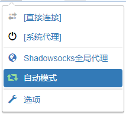
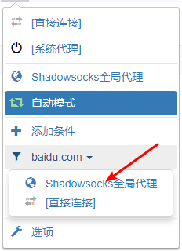
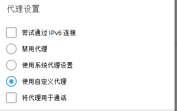
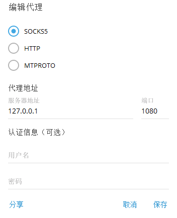

# 通过Socks5使用SSR


警告！此处教程非必要操作且难度较高，仅提供给愿意研究，鼓捣的人查看！在查看此文档前，请确保SSR已经完成了基本配置。SSR配置教程请[点击这里](../basic/windows/ssr.md)


## 前言

### 何为Socks5

> SOCKS5 是一个代理协议，它在使用TCP/IP协议通讯的前端机器和服务器机器之间扮演一个中介角色，使得内部网中的前端机器变得能够访问Internet网中的服务器，或者使通讯更加安全。（百度百科）

而很多软件内部自带socks5协议代理，这样可以通过软件内部的代理直接连接ssr，而不是通过ssr直接代理系统的方式。

### 这样做的好处

让ssr直接代理系统，可能是一种更加不可控，不可靠的行为。因为它会代理所有在这个系统中运行的软件，而这不一定符合您心里的预期。同时ssr还有一些BUG，导致其无法在pac模式，全局模式中生效，可能此时您只能通过socks5连接ssr。并且不得不承认的是，通过socks5连接ssr确实可以增加不少可玩性。

### Socks5在SSR中的设定


默认状态下，ssr已经启动了本地SOCKS5代理：服务器地址：**`127.0.0.1`** ； 端口：**`1080`** ；


您可以在SSR的`选项设置--本地代理`选项中更改端口，并允许设定密码，开启局域网访问等。

下方教程将按照默认的端口（1080），无密码的配置进行演示，如果您更改了端口，密码，请自行修改相关设置。

### 关于SSR模式的选择


开门见山，我们推荐您系统代理规则选择 ”**直连模式“** ，代理规则选 ”**全局“** 。


原因是，既然您想要使用socks5代理，就意味着您希望将代理的控制权交给软件而不是ssr，选择这两个选项可让ssr失去所有控制权，一切的代理规则均由您的软件决定，ssr将不再参与。此时，您只需要让ssr保持后台运行，选个节点，其余操作均可在其他软件内实现。但是这么选的后果也是有的，如果您不配置这个软件的socks5，那么它将永远不会被代理（当然这可能恰恰符合预期）。

## 范例

我们在这里提供了几个范例，您可以快速查看您所需要的。

> [范例1.Chrome/Firefox浏览器](socks5.md#fan-li-1-zai-chrome-huo-shi-yong-chrome-nei-he-de-lan-qi-firefox-zhong-shi-yong-lan-qi-cha-jian-tong-guo-socks-5-lian-jie-ssr)
>
> [范例2.Telegram](socks5.md#fan-li-2-zai-telegram-zhong-she-zhi-socks-5-yi-lian-jie-ssr)

### 范例1.在Chrome（或使用Chrome内核的浏览器）/ Firefox中使用浏览器插件通过socks5连接SSR

**1.插件安装**

首先您需要安装浏览器插件：`SwitchyOmega`，此插件您可以在 [Chrome官方商店](https://chrome.google.com/webstore/detail/padekgcemlokbadohgkifijomclgjgif) 或 [Firefox商店](https://addons.mozilla.org/en-US/firefox/addon/switchyomega/) （QQ浏览器自带的插件商城也有这个）安装，如果您无法访问官方商店，可以下载离线安装包进行安装。

> [下载安装包 for Chrome](https://github.com/FelisCatus/SwitchyOmega/releases/download/v2.5.20/SwitchyOmega_Chromium.crx)

在 Chrome 地址栏输入 chrome://extensions 打开扩展程序，拖动 .crx 后缀的 SwitchyOmega 安装文件到扩展程序中进行安装。

> [下载安装包 for Firefox](https://github.com/FelisCatus/SwitchyOmega/releases/download/v2.5.20/proxy_switchyomega-2.5.20-an+fx.xpi)

在 Firefox 地址栏输入 about:addons 打开插件管理 \(Add-Ons Manager\)， 选择扩展程序 \(Extensions\) ，拖动 .xpi 后缀的 SwitchyOmega 安装文件到扩展程序 \(Extensions\) 中进行安装。

**2.插件配置**

* 首先在您浏览器上找到插件图标，如图 
* 然后点击图标，再点击`选项`，进入插件配置界面。
* [点击这里下载配置文件](https://www.tzct.xyz/OmegaOptions.bak)，然后在插件配置界面，找到`导入/导出`选项，选择`从备份文件恢复`，然后选择刚才下载的配置文件完成导入。

> 本配置文件仅适用于使用SSR默认端口（1080）并且没有设定密码。如果您更改了端口或增加了密码，您需要自行更改插件中全局模式的设定。

* 导入后如图显示。默认推荐选择`自动模式`，在此模式下，该插件将根据Gfwlist规则对网站进行辨识，决定是否代理。您可以自行更改为其他规则，具体自己研究。`全局模式`不用赘述。选择`直接连接`则不通过任何代理。选择`系统代理`则把控制权交还给系统。

* 在这种情况下，已经可以正常进行使用了。您还可以自定义相关规则，例如这里如图，我希望百度以后走ssr，可以简单的在访问百度的时候点击插件，完成规则的添加。反之亦然，您可以非常方便的对规则进行更改，使之适合您的使用。更多的功能您可以自行摸索，这里不再赘述太多。

### 范例2.在Telegram中设置Socks5以连接SSR

* 首先进入Telegram的设置（settings）界面，找到**高级**（advanced）选项，点击进入。
* 在上方的网络与代理（Network and proxy）里，点击**连接类型**（connection type），选择使用**自定义代理**（use custom proxy），如图。

* 点击右下角的**添加代理**（add proxy），类型选择**socks5**，**服务器地址**（hostname）填`127.0.0.1`，**端口**（port）填`1080`（1080为默认，如果您修改了请自行更改），**用户名密码**（username/password）不用管（如果您设定了请自行填入），然后点击**保存**（save）。

* 在返回的页面里点击您刚才设定的代理，即可连接上。

