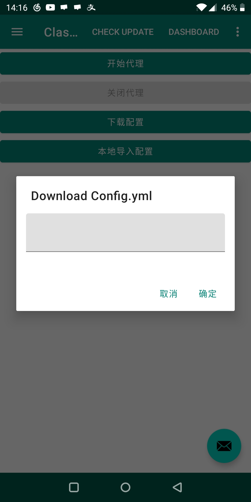
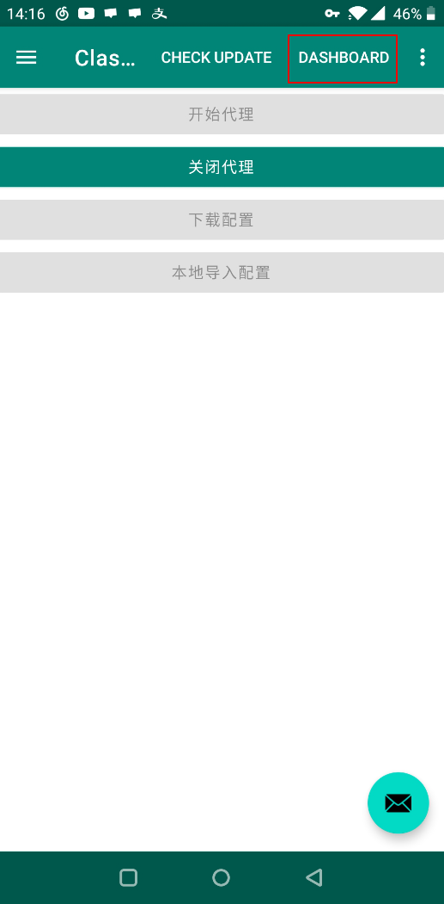
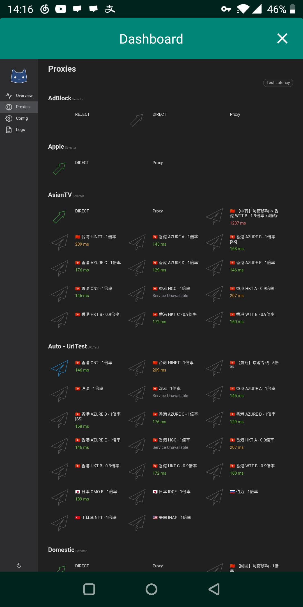
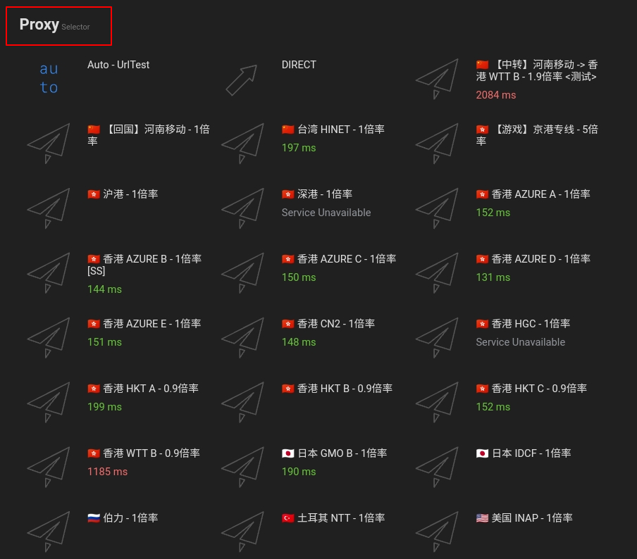

# ClashA


**安卓用户请注意！！**使用国产/自带浏览器可能会出现菜单无法展开，软件无法下载等BUG，建议使用**Chrome**浏览器打开本页面！



该应用处于测试期，不保证稳定，功能界面简陋，请谨慎使用。


## 前言


在使用本站服务前，我们建议您保存好本站的联系方式，以防止与我们失联。


1. 地址发布页，建议收藏！地址：[http://ctfb.xyz](http://ctfb.xyz)
2. TG频道：[点击关注](https://t.me/cctcloud) （TG是一个国外通讯软件，需要翻墙，具体的教程[在这里](../../advanced/telegram.md)！\)
3. TG群：TG群仅允许VIP会员加入，购买会员后，在用户中心的用户须知可见！

## 下载

[点击这里进入](https://github.com/ccg2018/ClashA/releases)Github项目页，下载安装文件（.apk）

## 对比传统SSR优势

* 拥有自动选择/切换节点功能；
* 自带的规则对比SSR的PAC或自带规则更为完善，减少误判；
* 可针对不同网站自动选择不同节点；
* 可以使用Adblock规则去广告（默认已开启）。

## 配置

1.前往订阅中心，到**Clash托管**处点击 “复制链接”


托管链接获取教程请[点击这里](../../panel.md#ding-yue-tuo-guan-lian-jie)


2.打开ClashA，再点击**“下载配置”**按钮，将地址粘贴进去，然后确定。

3.点击开始代理按钮，第一次使用会询问权限，允许即可。然后，点击上面的DASHBOARD

4.然后，会弹出如图所示的界面。

请向下拉，找到“Proxy”字段（如下图）。选择“Auto-UrlTest”即代表自动选择最佳节点（具体自动选择的哪个您可以在上面的“Auto-UrlTest”字段看到。）。如您有自己的使用习惯，也可自行选择节点。


这里还有很多选项，包括Domestic，Others，Adblock等等。这些属于策略组，如果您感兴趣，可以[点击这里](../../advanced/rules.md)查看相关教程。请勿在看教程之前随意修改，否则可能出现问题！



此时您已经可以正常访问国际互联网了


5.此后您可再次点击DASHBOARD进入此界面以随时调整配置。

## 其它

我们目前不确定 ClashA 能否自动更新配置，如节点列表有更新（或您修改了密码），您可以手动更新配置。即按照以上步骤重新导入托管链接并下载。

