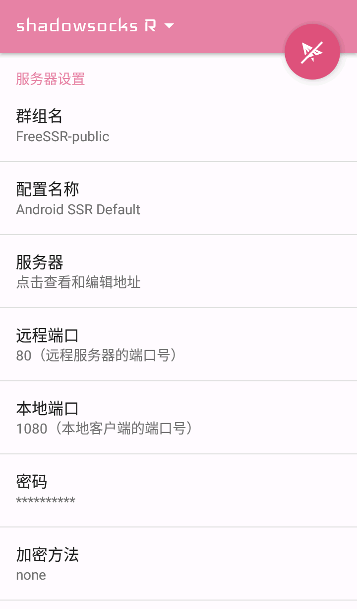
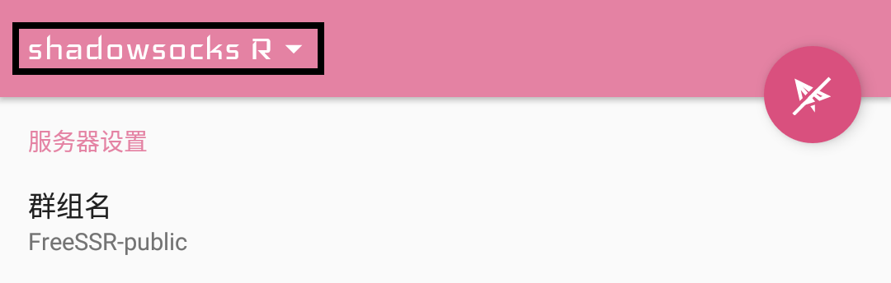
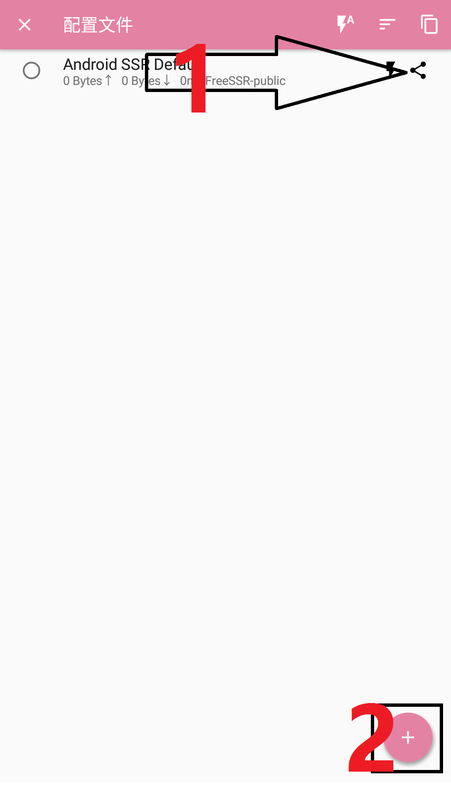
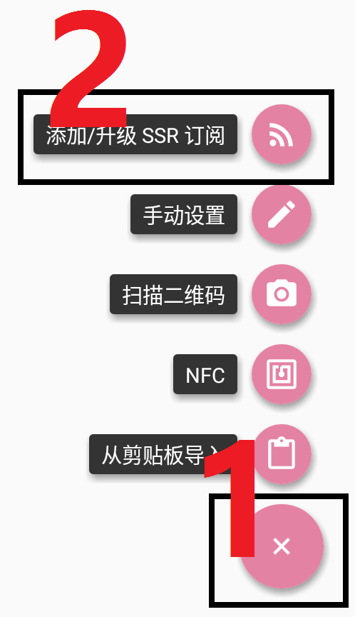
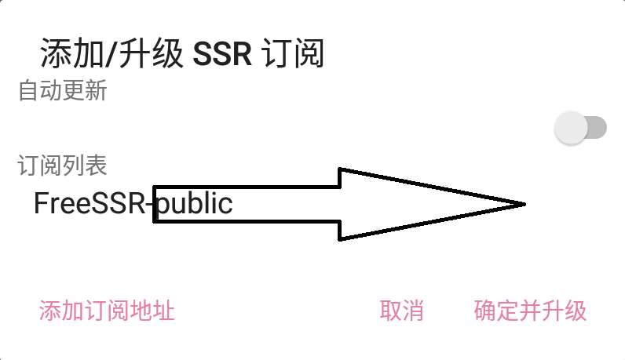
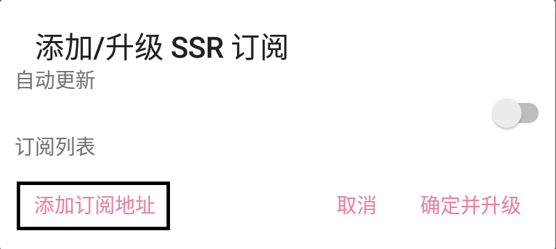
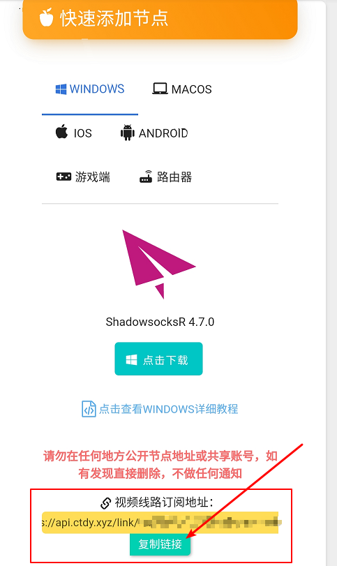
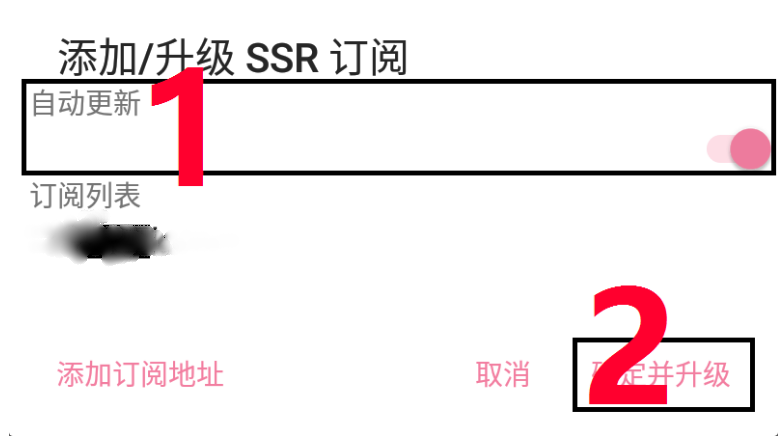
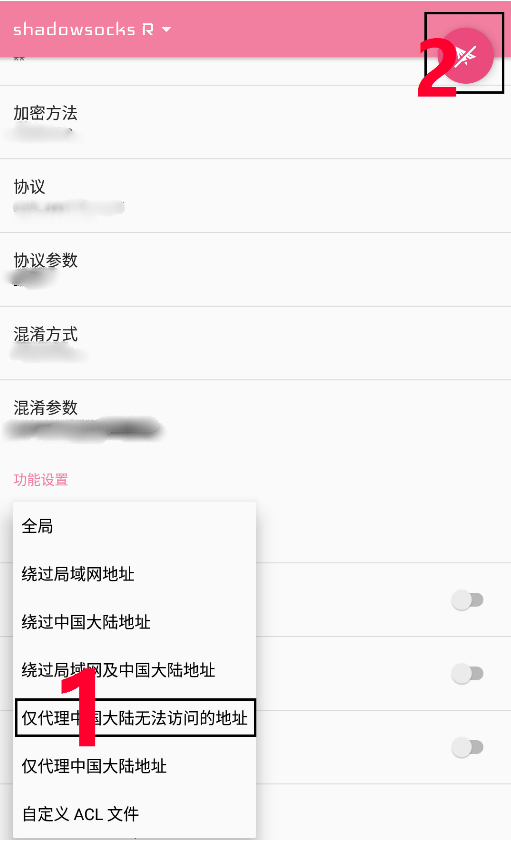

# SSR

* 系统要求： Android 4.0 及以上
* 设备要求： Android手机或平板设备

## 前言


在使用本站服务前，我们建议您保存好本站的联系方式，以防止与我们失联。


1. 地址发布页，建议收藏！地址：[http://ctfb.xyz](http://ctfb.xyz)
2. TG频道：[点击关注](https://t.me/cctcloud) （TG是一个国外通讯软件，需要翻墙，具体的教程[在这里](../../advanced/telegram.md)！\)
3. TG群：TG群仅允许VIP会员加入，购买会员后，在用户中心的用户须知可见！

## 软件下载

* 蓝奏云下载
* 腾讯微云下载：



## 软件安装

您可以在上方找到适用于Android的ShadowsocksR **APK安装包**，安装完毕后打开软件即可。

## 导入节点设置

1.打开 SSR\(R\) 应用程序。

2.点击顶部的\[shadowsocks R▼\]进入**节点列表**。

3.在\[Android SSR Default\]处向右滑动，以便删除软件自带的无效节点。

4.点击右下角\[+\]按钮。

5.选择\[添加/升级 SSR 订阅\]。

6.在弹出的窗口中删除自带无效订阅。（由于FreeSSR源已**停止维护**，将其置于订阅列表中可能影响订阅更新的速度）

7.再次点击\[+\]。

8.点击\[添加/升级 SSR 订阅\]

9.点击\[添加订阅地址\]，输入您的**订阅地址**。


订阅地址可以在阁下之 [用户中心](https://www.tzct.xyz/user) 下方找到。


10.勾选\[自动更新\]，并点击\[确定并升级\]。


点击后一直转圈？请[点击这里](../../other/faq.md#android)获取解决方案。


完成以上步骤后，节点列表将显示所有可用节点。

11.如果您没有使用过该软件，请继续向下看。

## 软件设置

> 在这里我们将指导您设置软件，如果您曾经使用过SSR\(R\)，则可以选择跳过此部分

### 选择节点


要开始使用，首先您要选择您想使用的节点。我们的节点遍布全球各地。而对于不同地区，不同运营商的用户，各个节点的速度，延迟不一致，您需要自行找到最适合您的节点。


1. 进入软件，点击软件左上角进入节点列表。
2. 点击您想要使用的节点即可。

### 路由


选择节点后向下翻即可看到本选项（见最下方图标记1）。本选项是用来选择软件要以何种方式运行。选项共有7项。下面将介绍各个选项有何不同。



懒得读的看这里！！小白用户建议选**“绕过局域网及中国大陆地址”**（可以一直开着不影响国内软件使用），不怕麻烦的选“自定义ACL文件”，但是**需要配置**，有很多好处！关于ACL配置请往下看。




所有网络链接全部通过软件代理。这会加大流量消耗且减慢国内网站速度，不推荐。




重点来了。该模式的好处是：能够获取最新的规则，软件自带的规则已经很老旧了，有一些网站无法做到精准识别。第二个好处是能去广告。



嫌麻烦或者读不懂完全可以放弃，选择“绕过局域网及中国大陆地址”即可，量力而行！


1. 路由选择“自定义ACL文件”，然后会弹出对话框。
2. 在弹出的框中粘贴进如下的链接：

> 注意，在这里我们提供了多种链接，代表不同的规则。规则来自于[ACL4SSR](https://github.com/ACL4SSR/ACL4SSR)，感谢！

* 黑名单过滤 + 广告

[https://raw.githubusercontent.com/ACL4SSR/ACL4SSR/master/gfwlist-banAD.acl](https://raw.githubusercontent.com/ACL4SSR/ACL4SSR/master/gfwlist-banAD.acl)

* 白名单过滤 + 广告

[https://raw.githubusercontent.com/ACL4SSR/ACL4SSR/master/banAD.acl](https://raw.githubusercontent.com/ACL4SSR/ACL4SSR/master/banAD.acl)

两者差别如下（打 ✔ 代表走我们的服务）：

| 名称 | 国内网站 | 国外正常网站 | 国外被墙的 |
| :---: | :---: | :---: | :---: |
| 黑名单 | ✖  | ✖  | ✔  |
| 白名单 | ✖  | ✔  | ✔  |

更多规则请前往[项目原地址](https://github.com/ACL4SSR/ACL4SSR)查看。

3.点击确定，等待刷新完毕即可。



包括：绕过局域网地址，绕过中国大陆地址，绕过局域网及中国大陆地址，仅代理中国大陆无法访问的地址，仅代理中国大陆地址。都是字面意思，很好理解。



### 开启服务

如需使用，只需点击右上角小飞机图标（见下图标记2）。若要查看延迟，请点击\[检查网络连接\]。


第一次使用可能会向您索要系统权限，通过即可。



至此您已经配置完成可以上网了。



配置完成还是不能上网？请[点击这里](../../other/faq.md#android)获取解决方案


### 手动更新订阅


在一些情况下（如网站节点更新，或您从免费账户升级至VIP后），您需要手动更新订阅，以获取最新节点。


* 点击顶部的\[shadowsocks R▼\]进入**节点列表**。
* 点击右下角加号，点击\[添加/升级 SSR 订阅\]，然后点击\[确定并升级\]即可。

