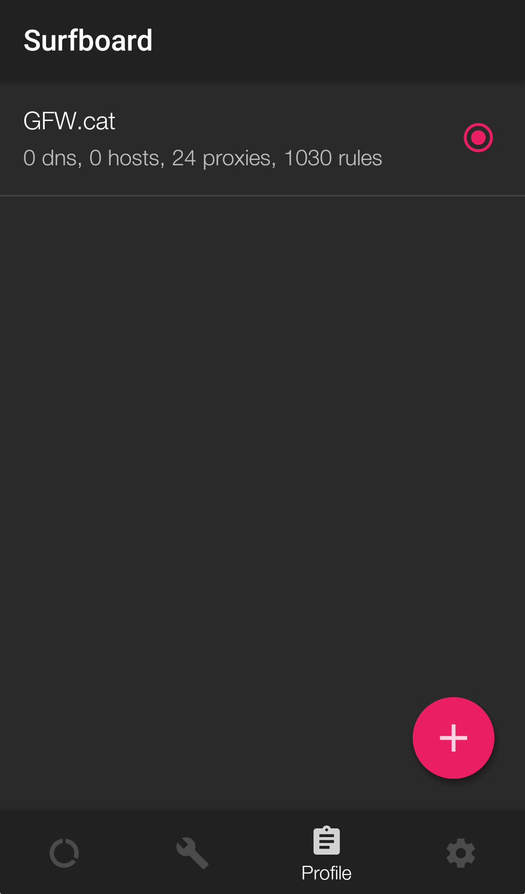
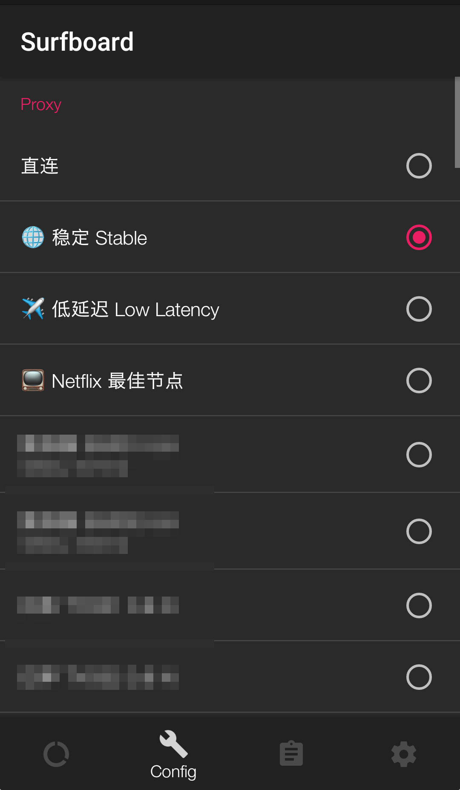

# Surboard


该应用处于测试期，不保证稳定，有一定的操作难度！


> Surfboard 是一个正在进行 Beta 测试的 Android 代理应用，兼容 Surge 配置。[开发者 Twitter](https://twitter.com/getsurfboard)
>
> 请[前往 HockeyApp 测试平台](https://rink.hockeyapp.net/recruit/2113783c503645abb0a5ec6317e1a169)获取 Beta 版软件（需要注册，请不要使用第三方平台登录）

## 软件下载

 加入 Beta 测试后，请[前往 HockeyApp 下载](https://rink.hockeyapp.net/apps/37108b2364df445b8461466a0cd734a9) Android apk 安装文档。

## 在 Surfboard 中使用订阅配置

 打开 Android 设备的浏览器 \(推荐 Chrome\)，前往 GFW.cat 客户中心 - [我的服务](https://my.gfw.cat/clientarea.php?action=productdetails)，点击「订阅信息」中的「其它配置」。

在新页面中，点击「Surge 托管配置」右侧的复制。

2.打开 Surfboard，选择下方第三个选项卡 Profile \(配置文件\)，点击页面中的 "+" 加号，选择 "Download from URL" ，粘贴配置文件链接并下载。

3.下载后可长按配置文件，重命名文件\(Rename\)，更新配置 \(Check Update\)，或者删除配置。

4.回到下方第二个选项卡 Config，我们为您提供了三个自动节点「稳定」& 「低延迟」和「Netflix 最佳节点」，这三个节点可以根据网络环境自动切换至最佳节点。如您有自己的使用习惯，也可自行选择节点。

5.选择节点后，回到第一个选项卡 Switch 页面，点击下方红色按钮开启。系统可能会询问是否允许 VPN 连接，点击允许。


至此您已经可以开始上网了。


6.您可以返回 Surfboard 应用切换代理节点或关闭代理，我们建议您 24 小时开启（会有 10% 以下的电量消耗）。

