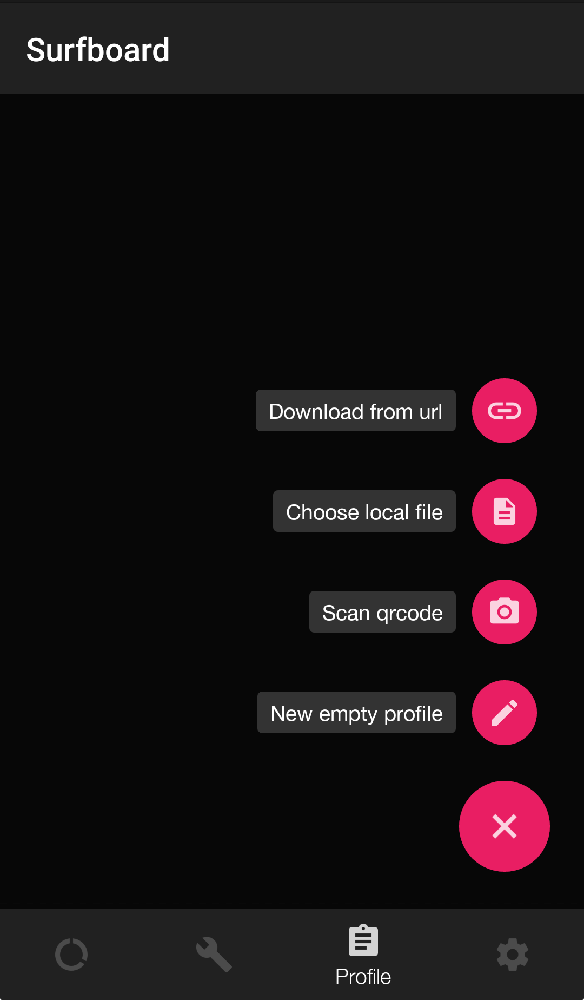
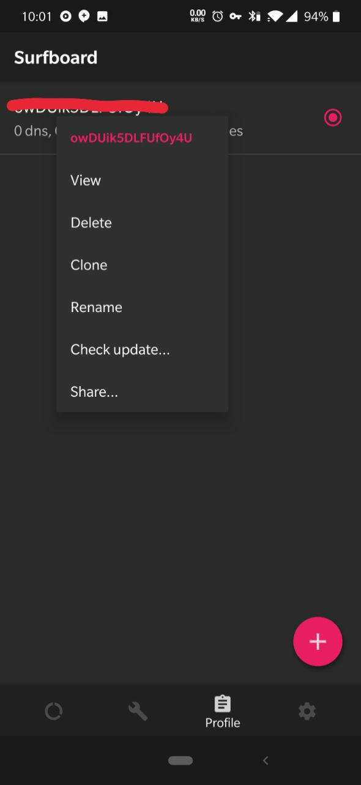
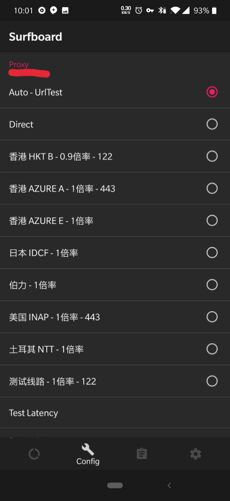

# Surfboard


**如果您是免费用户请注意：**免费用户仅能使用SSR，不支持本软件！



**安卓用户请注意！！**使用国产/自带浏览器可能会出现菜单无法展开，软件无法下载等BUG，建议使用**Chrome**浏览器打开本页面！



该应用处于测试期，不保证稳定，有一定的操作难度！


> Surfboard 是一个正在进行 Beta 测试的 Android 代理应用，兼容 Surge 配置。[开发者 Twitter](https://twitter.com/getsurfboard)

## 前言


在使用本站服务前，我们建议您保存好本站的联系方式，以防止与我们失联。


1. 地址发布页，建议收藏！地址：[http://ctfb.xyz](http://ctfb.xyz)
2. TG频道：[点击关注](https://t.me/cctcloud) （TG是一个国外通讯软件，需要翻墙，具体的教程[在这里](../../advanced/telegram.md)！\)
3. TG群：TG群仅允许VIP会员加入，购买会员后，在用户中心的用户须知可见！

## 软件下载

* 蓝奏云下载：[点击这里下载](https://www.lanzous.com/i4q0uni)
* 腾讯微云下载：[点击这里下载](https://share.weiyun.com/5apzD05)

## 对比传统SSR优势

* 拥有自动选择/切换节点功能；
* 自带的规则对比SSR的PAC或自带规则更为完善，减少误判；
* 可针对不同网站自动选择不同节点；
* 可以使用Adblock规则去广告（默认已开启）。

## 在 Surfboard 中使用订阅配置

1.前往订阅中心获取托管链接（可使用一键托管）。


托管链接获取教程请[点击这里](../../panel.md#ding-yue-tuo-guan-lian-jie)



仅一键托管失败参考第二步，成功请跳过。


2.打开 Surfboard，选择下方第三个选项卡 Profile \(配置文件\)，点击页面中的 "+" 加号，选择 "Download from URL" ，粘贴配置文件链接并下载。

3.下载后可长按配置文件，重命名文件\(Rename\)，更新配置 \(Check Update\)，或者删除配置。

4.回到下方第二个选项卡 Config，找到Proxy字段（如图，默认就在最上面）。在此处您可以选择节点。Auto-UrlTest即代表自动选择最佳。如您有自己的使用习惯，也可自行选择节点。


下方还有很多字段，包括Domestic，Others，Adblock等等。这些属于策略组，如果您感兴趣，可以[点击这里](../../advanced/rules.md)查看相关教程。请勿在看教程之前随意修改，否则可能出现问题！


5.选择节点后，回到第一个选项卡 Switch 页面，点击下方红色按钮开启。系统可能会询问是否允许 VPN 连接，点击允许。


至此您已经可以开始上网了。


6.您可以返回 Surfboard 应用切换代理节点或关闭代理，我们建议您 24 小时开启（会有 10% 以下的电量消耗）。

