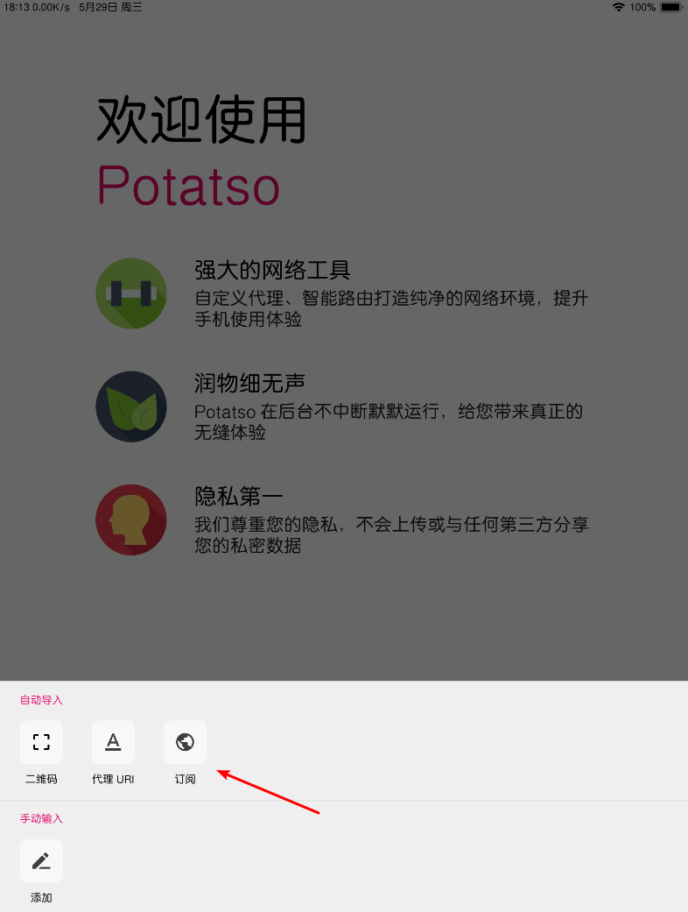
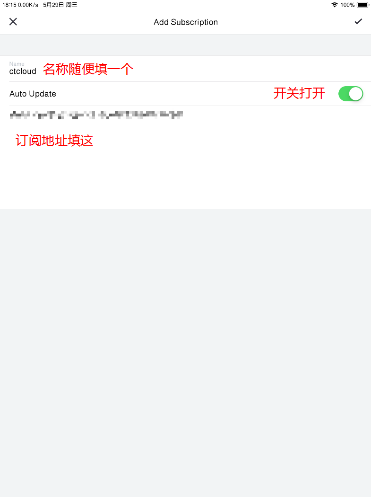
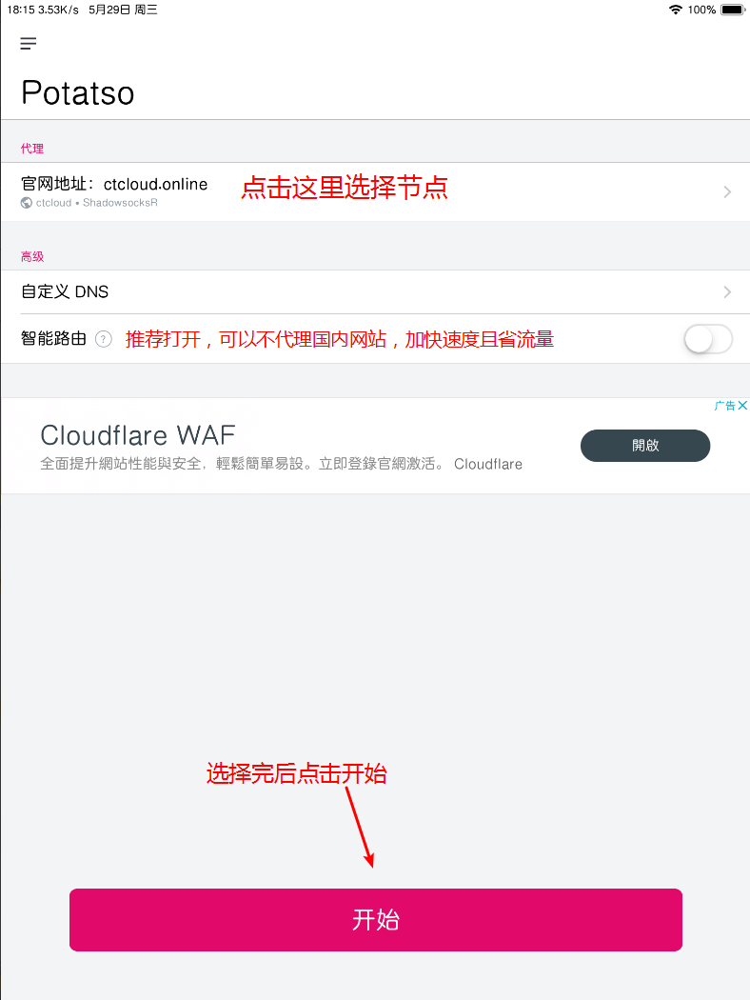
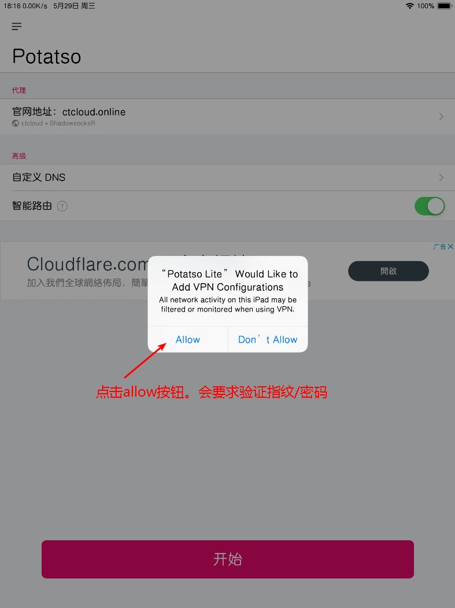

# Potatso Lite

## 前言


在使用本站服务前，我们建议您保存好本站的联系方式，以防止与我们失联。


1. 地址发布页，建议收藏！地址：[http://ctfb.xyz](http://ctfb.xyz)
2. TG频道：[点击关注](https://t.me/cctcloud) （TG是一个国外通讯软件，需要翻墙，具体的教程[在这里](../../advanced/telegram.md)！\)
3. TG群：TG群仅允许VIP会员加入，购买会员后，在用户中心的用户须知可见！

## 下载


此应用为免费应用。


**如果您拥有国外Appstore账号：**

请点击下方链接直接下载（推荐）



**如果您只有国内Appstore账号：**

请先前往Appstore下载 ”**Testflight**“，然后点击下方链接，加入beta测试并下载



## 配置

1.前往用户中心获取订阅链接。


订阅链接获取教程请[点击这里](../../panel.md#ding-yue-tuo-guan-lian-jie)


2.点击添加配置，然后如图操作：

3.完成后，状态栏显示VPN图标，设置完成。


如果您要更换节点，一定要先点击停止，然后再更换，不然不生效。


