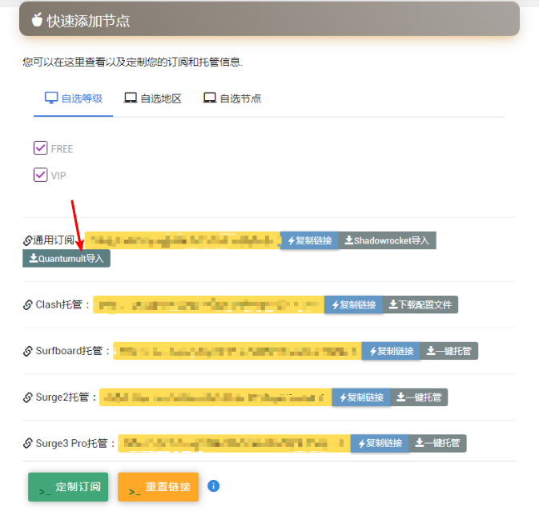
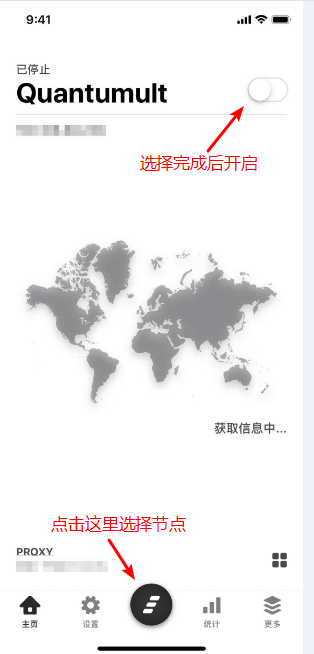

# Quantumult


本站不提供该软件的下载账号/方式，您需要自行购买下载。


## 前言


在使用本站服务前，我们建议您保存好本站的联系方式，以防止与我们失联。


1. 地址发布页，建议收藏！地址：[http://ctfb.xyz](http://ctfb.xyz)
2. TG频道：[点击关注](https://t.me/cctcloud) （TG是一个国外通讯软件，需要翻墙，具体的教程[在这里](../../advanced/telegram.md)！\)
3. TG群：TG群仅允许VIP会员加入，购买会员后，在用户中心的用户须知可见！

## 下载


此应用为付费应用。


此应用在国区Appstore被下架，请使用国外账号进行购买，下载操作。

## 配置

## 导入节点

1.点击下方，前往用户中心

2.往下翻，找到订阅链接位置，点击”Quantumult导入“按钮即可。


点击没有反应？没有看到这个按钮？请使用“**Safari**”打开本站，进行配置操作。


3.软件会被拉起，请点击确认按钮。然后回到软件主页，点击下方的黑色按钮查看节点列表，并选择节点。选择完成后，点击上方开关即可（如图）。


初次使用会申请权限，点击“**allow**”并验证指纹/密码即可。


