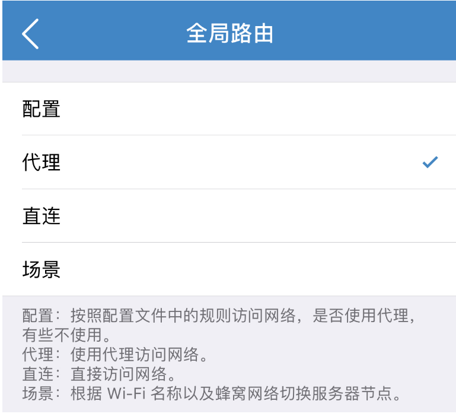

# Shadowrocket

* 系统要求： iOS 10及以上
* 设备要求： 运行有iOS的设备
* 阁下可以从下方教程中了解如何安装

## 前言


在使用本站服务前，我们建议您保存好本站的联系方式，以防止与我们失联。


1. 地址发布页，建议收藏！地址：[http://ctfb.xyz](http://ctfb.xyz)
2. TG频道：[点击关注](https://t.me/cctcloud) （TG是一个国外通讯软件，需要翻墙，具体的教程[在这里](../../advanced/telegram.md)！\)
3. TG群：TG群仅允许VIP会员加入，购买会员后，在用户中心的用户须知可见！

## 软件安装


免费用户看这里：请下载Potatso Lite进行使用本站服务。因为它是免费应用。下载配置教程[点击这里查看](potatso-lite.md)。



由于中国区Shadowrocket已下架，您可使用自己的**其他国家区域**账号购买Shadowrocket或者使用我们提供的美区账号。要使用我们提供的美区账号请前往 [用户中心](https://www.tzct.xyz/user/) 查看“**用户须知**”部分。注意，只有购买本站VIP、试用的用户可以获取！


### 登录我们提供的Appstore账号


请参照这里的说明进行登录，千万不要登录icloud！否则会有锁机风险！


1.打开手机“**设置**”

2.向下翻，找到“**Itunes Store 与 App Store**”，打开

3.在上方点击自己的账号，选择“**退出登录**”

4.再点击登录键，输入我们提供的账号密码。


要使用我们提供的美区账号请前往 [用户中心](https://www.tzct.xyz/user/) 查看“**用户须知**”部分。注意，只有购买本站VIP、试用的用户可以获取！



登录时提示账号被锁？[点击这里](../../other/unlock.md)进行自助解锁或在网页右下角联系我们进行解锁（可能需要一些时间）


5.登录完成后即可前往Appstore搜索“**shadowrocket**”进行下载。


可能应用提示没有购买，还需要付费，不用担心，直接点击即可，不会重复扣费！（实在担心杀掉Appstore后台，重新搜索软件，就好了）


6.下载完毕后请换回自己的账号。

## 导入节点

1.前往订阅中心，查看订阅链接


订阅链接获取教程请[点击这里](../../panel.md#ding-yue-tuo-guan-lian-jie)


2.找到通用订阅位置，点击”Shdowrocket导入“按钮即可。


点击没有反应？请使用“**Safari**”打开本站，进行配置操作。还是不行？[点击这里查看](shadowrocket.md#shou-dong-tian-jia-ding-yue)手动导入教程。


3.导入节点后，请继续向下看完成配置。


一个小提示：请勿在软件首页执行双指缩放的动作，不然节点会被压缩成三个。如果您发现您的节点只有三个，请双指放大一下即可。


## 软件设置

### 选择节点


要开始使用，首先您要选择您想使用的节点。我们的节点遍布全球各地。而对于不同地区，不同运营商的用户，各个节点的速度，延迟不一致，您需要自行找到最适合您的节点。


导入节点后，在软件首页就能看见节点了。点击任意您喜欢的节点，前面会出现一个黄点，就代表选择成功了。

### 全局路由

> 全局路由在软件首页上方可以看到。本选项是用来选择软件要以何种方式运行。选项共有4项：配置，代理，直连，场景。下面将介绍各个选项有何不同。


我们推荐使用 **配置** 选项，但是它需要进行进一步设置才可以使用，具体请继续向下看



如果懒得看的话就选择 **代理** 吧，这样就和传统VPN一样，用完记得关。





本选项可以使用一些规则，比如访问的网站在国内则直接连接以加快速度减少流量消耗，网站在国外则通过本软件的服务进行连接（甚至能去广告）。这样的好处是您可以始终开启开关而不用担心影响日常使用。但是要使用该功能，您需要进行一些配置。



如果您嫌麻烦或者不会弄可以不弄，全局路由选择**代理**即可，请量力而行！


1. 首先，点击软件下方菜单中的**配置**
2. 点击右上角的加号，在弹出的框中粘贴进如下的链接：

> 注意，在这里我们提供了多种链接，代表不同的规则。规则来自于[Shadowrocket-ADBlock-Rules](https://github.com/h2y/Shadowrocket-ADBlock-Rules)，感谢！

* 黑名单过滤 + 去广告

  [https://raw.githubusercontent.com/h2y/Shadowrocket-ADBlock-Rules/master/sr\_top500\_banlist\_ad.conf](https://raw.githubusercontent.com/h2y/Shadowrocket-ADBlock-Rules/master/sr_top500_banlist_ad.conf)

* 白名单过滤 +去广告

  [https://raw.githubusercontent.com/h2y/Shadowrocket-ADBlock-Rules/master/sr\_top500\_whitelist\_ad.conf](https://raw.githubusercontent.com/h2y/Shadowrocket-ADBlock-Rules/master/sr_top500_whitelist_ad.conf)

两者差别如下（打 ✔ 代表走我们的服务）：

| 名称 | 国内网站 | 国外正常网站 | 国外被墙的 |
| :---: | :---: | :---: | :---: |
| 黑名单 | ✖  | ✖  | ✔  |
| 白名单 | ✖  | ✔  | ✔  |

> 更多规则请前往[项目原地址](https://github.com/h2y/Shadowrocket-ADBlock-Rules)查看。

3.点击下载按钮后，在软件的**远程文件**中可以看见刚才的链接，点击，然后选择**使用配置**。

4.现在您可以在**本地文件**中看到它，点击后左面会出现黄点，证明您正在使用该规则。

5.此时您可以在**全局路由**中使用**“配置”**选项了。



无需任何配置，即可使用。该模式下所有链接均会通过软件进行，和传统vpn没有差别。这会加大流量消耗并使国内服务减慢。所以用完记得关闭。



**无视这俩货吧**

直连就任何网站都不通过软件了（别用）。场景可以自定义，这里不做赘述。



### 自动更新订阅


我们的节点会时常更新，如不开启此选项，则可能导致连接不上的情况。建议开启！


1. 点击软件下方菜单的“**设置**”
2. 向下翻，找到“**服务器订阅**”，点击
3. 将“**打开时更新**”的选项开启即可

## 开启服务

在软件首页，打开最上方开关即可。


首次使用可能会需要同意VPN系统权限，此时您只需点击“**allow**”并验证您的Touch ID/Face ID即可。



至此您已经可以开始上网了。



设置完成仍无法访问？请[点击这里](../../other/faq.md#ios)获取解决方案


## 其他配置

### 手动更新订阅


在一些情况下（如网站节点更新，或您从免费账户升级至VIP后），您需要手动更新订阅，以获取最新节点。


在软件首页，找到我们的订阅（api.ctdy.xyz\)，左滑，然后点击**更新**即可。

### 手动添加订阅


仅当上方的一键导入失败时才按照如下教程操作，其余情况无视。


1.请点击位于软件右上角的\[+\]按键

2.在类型中选择**Subscribe**

3.在URL栏中输入**订阅地址**，点击完成后，即可自动更新节点。


订阅地址可以在阁下之 [用户中心](https://www.tzct.xyz/user) 下方找到。



无法获取到节点？出现错误？请[点击这里](../../other/faq.md#ios)获取解决方案



至此节点已经导入完成。请[点击这里继续查看配置教程](shadowrocket.md#ruan-jian-she-zhi)


