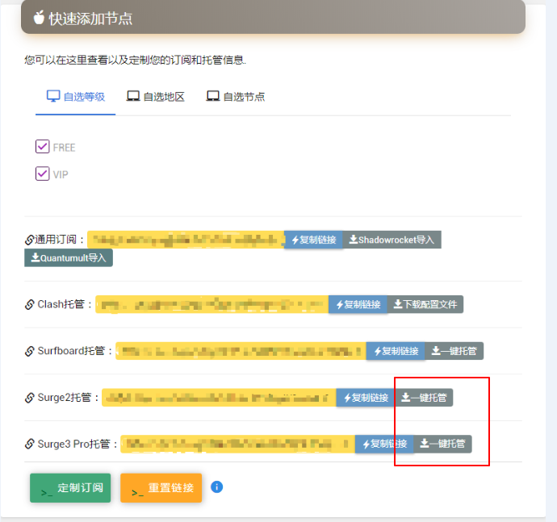
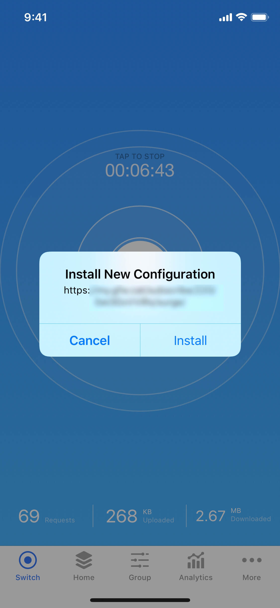
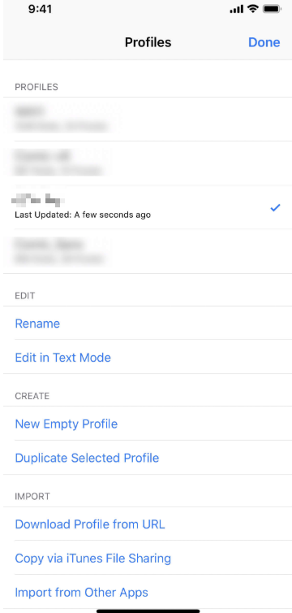
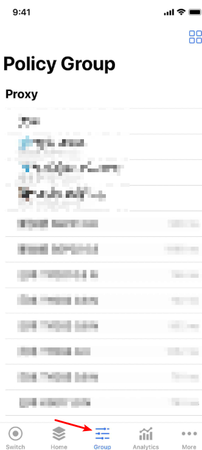
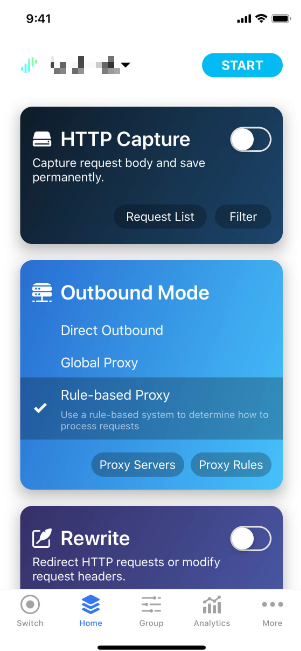

# Surge

## 前言


在使用本站服务前，我们建议您保存好本站的联系方式，以防止与我们失联。


1. 地址发布页，建议收藏！地址：[http://ctfb.xyz](http://ctfb.xyz)
2. TG频道：[点击关注](https://t.me/cctcloud) （TG是一个国外通讯软件，需要翻墙，具体的教程[在这里](../../advanced/telegram.md)！\)
3. TG群：TG群仅允许VIP会员加入，购买会员后，在用户中心的用户须知可见！

## 下载


此应用为付费应用。您需要自行购买。


此应用在国区Appstore被下架，请使用国外账号进行购买，下载操作。

## 对比传统SSR优势

* 拥有自动选择/切换节点功能；
* 自带的规则对比SSR的PAC或自带规则更为完善，减少误判；
* 可针对不同网站自动选择不同节点；
* 可以使用Adblock规则去广告（默认已开启）。

## 导入配置

1.点击下方，前往用户中心

2.往下翻，找到订阅链接位置，点击”一键托管“按钮即可（自行根据自己软件版本选择）。

3.接下来在 Surge 应用中，点击安装 \(Install\) 配置

4.在 Surge 配置页面中，可以看到已安装的配置，选择刚刚下载的配置 。

5.打开策略组 \(Group\) 页面。在Proxy策略组中选择”**Auto-UrlTest**“（自动选择节点）或选择自己需要的节点以完成配置。更多策略组的说明请[点击这里查看](../../advanced/rules.md)

6.选择节点后，前往首页 \(Home\) ，点击「开始」\(START\) 。如您首次使用 Surge，iOS 会要求配置 VPN，需要验证 Touch ID 或设备密码。

## 进阶

### **「今天」视图小组件 \(aka Today Widget\)**

Surge 提供了「今天」视图小组件（又称为 Today Widget），您可以在 iOS 的「今天」视图中快速开关或切换节点，请参考 [Apple 支持](https://support.apple.com/zh-cn/HT207122)的页面获取使用方式。


我们不是 Surge 的开发者和销售者，关于 Surge 软件本身的问题（如软件授权 / 软件更新），请向 Surge 开发者询问。


