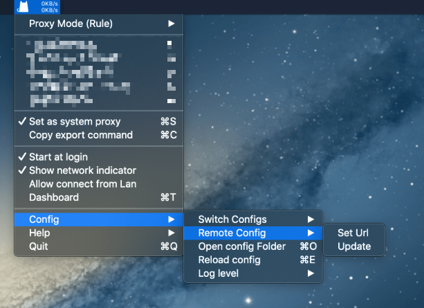

# ClashX


**如果您是免费用户请注意：**免费用户仅能使用SSR，不支持本软件！


## 前言


在使用本站服务前，我们建议您保存好本站的联系方式，以防止与我们失联。


1. 地址发布页，建议收藏！地址：[http://ctfb.xyz](http://ctfb.xyz)
2. TG频道：[点击关注](https://t.me/cctcloud) （TG是一个国外通讯软件，需要翻墙，具体的教程[在这里](../../advanced/telegram.md)！\)
3. TG群：TG群仅允许VIP会员加入，购买会员后，在用户中心的用户须知可见！

## 软件下载

[点击这里进入](https://github.com/yichengchen/clashX/releases)Github项目页，下载dmg文件。

## 对比传统SSR优势

* 拥有自动选择/切换节点功能；
* 自带的规则对比SSR的PAC或自带规则更为完善，减少误判（特别对于MAC的SSR根本不能使用自动规则）；
* 可针对不同网站自动选择不同节点；
* 可以使用Adblock规则去广告（默认已开启）。

## 配置

1.前往订阅中心获取托管链接。


托管链接获取教程请[点击这里](../../panel.md#ding-yue-tuo-guan-lian-jie)


2.开启 ClashX，点击上方任务栏中的 ClashX -&gt; Config -&gt; Remote config -&gt; Set URL，粘贴链接并确认

3.找到Proxy选项，在此处您可以选择节点。Auto-UrlTest即代表自动选择最佳。如您有自己的使用习惯，也可自行选择节点。


下方还有很多选项，包括Domestic，Others，Adblock等等。这些属于策略组，如果您感兴趣，可以[点击这里](../../advanced/rules.md)查看相关教程。请勿在看教程之前随意修改，否则可能出现问题！


4.开启 **Start at login** 和 **Set as system Proxy**，实现开机自启并自动设置为系统代理。  


此时您已经可以正常访问国际互联网了


5.之后您可以在任务栏中切换代理节点或关闭代理，我们建议您 24 小时开启应用。  

## 其它

我们目前不确定 ClashX 能否自动更新配置，如节点列表有更新（或您修改了密码），您可以手动更新配置。

