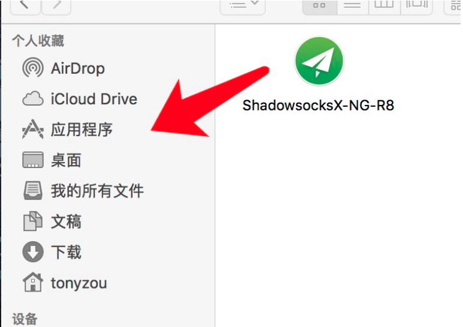
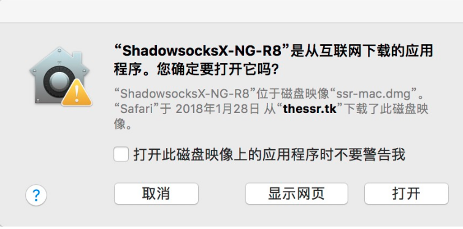
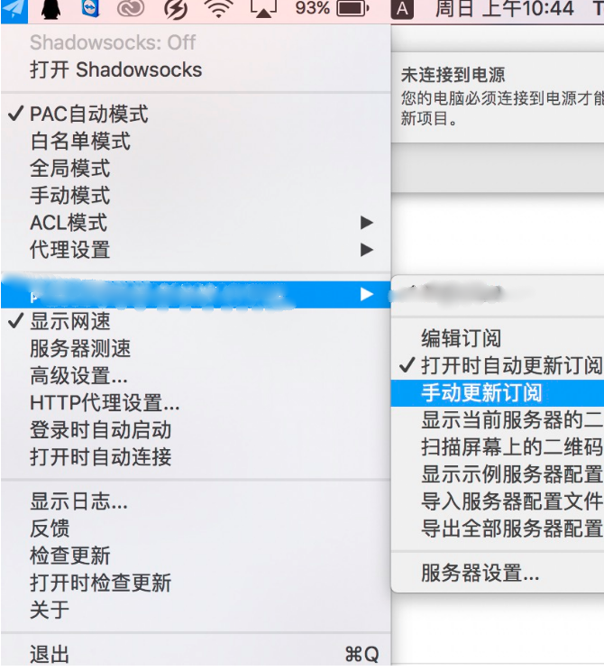
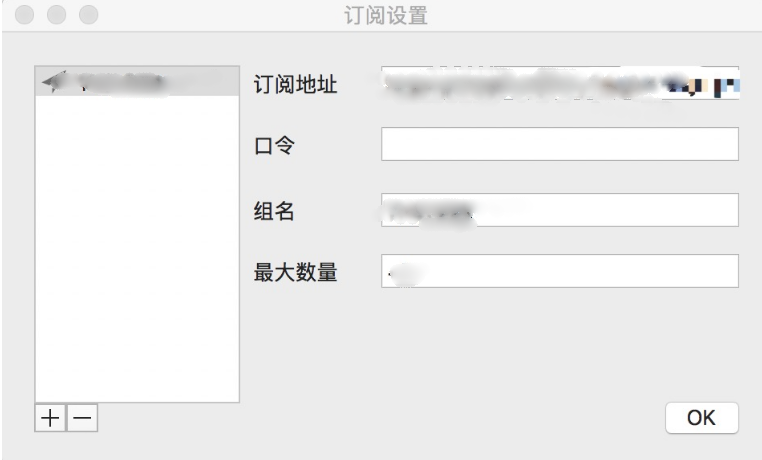

# ShadowsocksX-NG-R8

* 系统要求： macOS 10.11 以上
* 设备要求： Macbook / Macbook Air / Mackbook Pro / iMac / iMac Pro / Mac Pro / Mac mini

## 前言


在使用本站服务前，我们建议您保存好本站的联系方式，以防止与我们失联。


1. 地址发布页，建议收藏！地址：[http://ctfb.xyz](http://ctfb.xyz)
2. TG频道：[点击关注](https://t.me/cctcloud) （TG是一个国外通讯软件，需要翻墙，具体的教程[在这里](../../advanced/telegram.md)！\)
3. TG群：TG群仅允许VIP会员加入，购买会员后，在用户中心的用户须知可见！

## 软件下载

* 蓝奏云：

* 腾讯微云：



## 软件安装

1.您可以在上方找到**ShadowsocksX-NG-R8**安装包的下载链接。

2.下载完成后将下载的**dmg安装包文件** **"ShadowsocksX-NG-R8"** 拖动至**应用程序**中。

3.单击鼠标右键打开**ShadowsockX-NG-R8** ,将会弹出如下对话框：

4.在此对话框中单击\[打开\]按钮。

## 导入节点设置

1.在**顶部菜单栏**找到**小飞机图标** ，单击**小飞机图标**，选择 \[节点列表\]（下图中 阿里云国际版 新加坡 01节点）。

2.选择\[编辑订阅\]，将弹出如下对话框:

3.到网站用户中心复制**订阅链接**， 将其粘贴到上图对话框的\[订阅地址\]中。单击\[OK\]按钮。


订阅链接获取教程请[点击这里](../../panel.md#ding-yue-tuo-guan-lian-jie)


4.在图片所示处选择\[手动更新订阅\]，稍等片刻，节点列表中将会显示出可用节点。

## 软件设置

1.进入**节点列表**选择要使用的节点。

2.请点击**全局模式**


目前测试pac自动模式有bug，不能使用，请使用全局模式。用完记得关，不然会浪费流量。


3.单击 **打开Shadowsocks** 即可开始使用。

4.**打开时自动连接** 和 **登陆时自动启动** 可依照个人习惯开启。

## 其他配置

### 手动更新订阅


在一些情况下（如网站节点更新，或您从免费账户升级至VIP后），您需要手动更新订阅，以获取最新节点。


参照上方[导入节点设置](shadowsocksx.md#dao-ru-jie-dian-she-zhi)的步骤，直接点击手动更新订阅即可，无需重新填入订阅地址。

