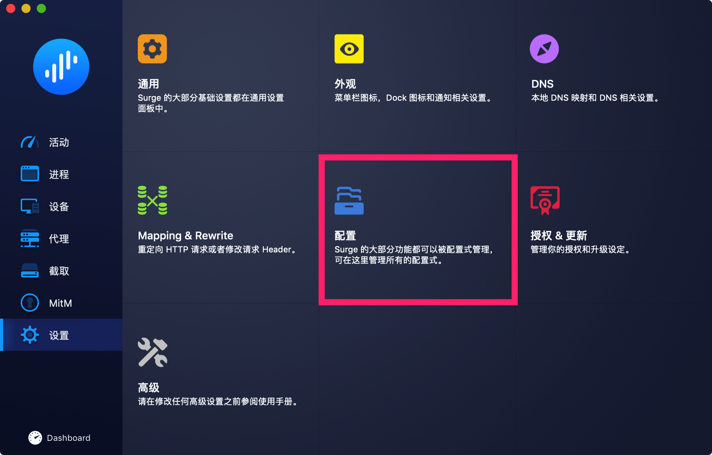
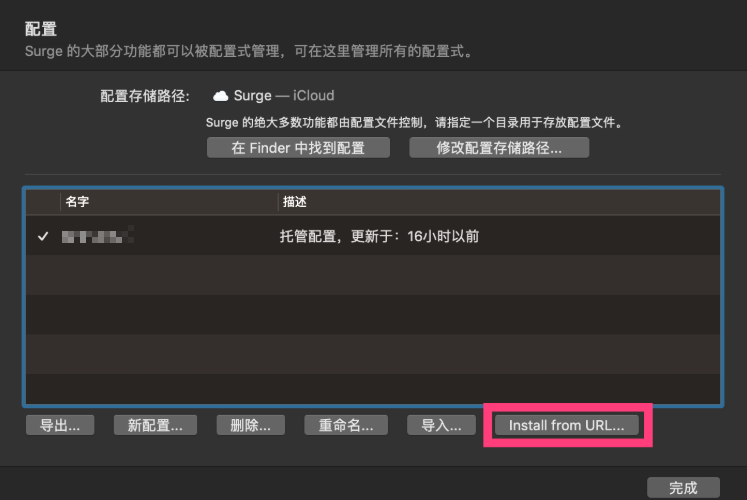
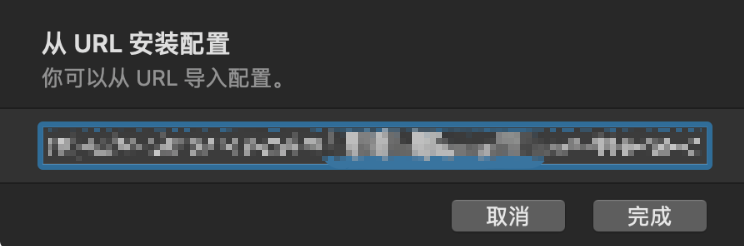

# Surge


**如果您是免费用户请注意：**免费用户仅能使用SSR，不支持本软件


## 前言


在使用本站服务前，我们建议您保存好本站的联系方式，以防止与我们失联。


1. 地址发布页，建议收藏！地址：[http://ctfb.xyz](http://ctfb.xyz)
2. TG频道：[点击关注](https://t.me/cctcloud) （TG是一个国外通讯软件，需要翻墙，具体的教程[在这里](../../advanced/telegram.md)！\)
3. TG群：TG群仅允许VIP会员加入，购买会员后，在用户中心的用户须知可见！

## 购买&下载

Surge Mac 是一个独立付费应用，您需要在[官网单独购买授权](https://nssurge.com/)。

## 对比传统SSR优势

* 拥有自动选择/切换节点功能；
* 自带的规则对比SSR的PAC或自带规则更为完善，减少误判（特别对于MAC的SSR根本不能使用自动规则）；
* 可针对不同网站自动选择不同节点；
* 可以使用Adblock规则去广告（默认已开启）。

## 配置

> 本站兼容Surge2和Surge3。下方将使用Surge3作为示范。

1.前往用户中心获取托管链接。


托管链接获取教程请[点击这里](../../panel.md#ding-yue-tuo-guan-lian-jie)


2.复制托管地址并根据以下如图步骤导入

## 策略组

在Proxy策略组中选择”**Auto-UrlTest**“（自动选择节点）或选择自己需要的节点以完成配置。更多策略组的说明请[点击这里查看](../../advanced/rules.md)


我们不是 Surge 的开发者和销售者，关于 Surge 软件本身的问题（如软件授权 / 软件更新），请向 Surge 开发者询问


