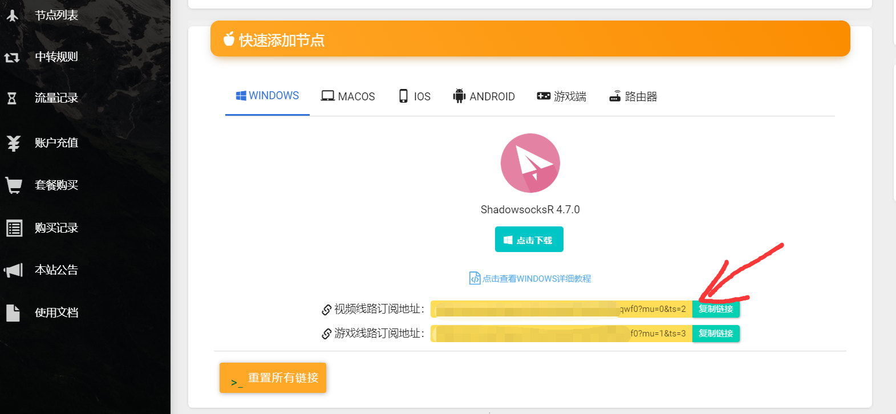

# Koolshare LEDE - SSR

Koolshare LEDE 是 Openwrt x64 \(LEDE\) 路由器操作系统的 Koolshare 社区分支。

关于如何刷入固件，请访问 [Koolshare 社区](http://koolshare.cn/forum-97-1.html)

## **在 Koolshare LEDE 中配置**

配置前，建议将您的 LEDE 固件升级至最新版本。

打开浏览器，前往[用户中心](https://www.tzct.xyz/user)下方，复制订阅地址。

在「酷软」中下载「科学上网」后，进入「科学上网」页面。

在「节点管理 -&gt; 节点管理」中，填写 SSR 节点订阅链接，并点击右侧的 "+" 添加，其它选项请参考下图。

保存订阅设置之后，回到该页面，点击「手动更新订阅」。

回到「帐号设置」页面，选择需要使用的服务器节点，提交并开启「koolss开关」。

操作完成后，你就可以正常访问国际互联网了，之后您可以返回该页面切换代理节点或关闭代理，我们建议您 24 小时开启。

