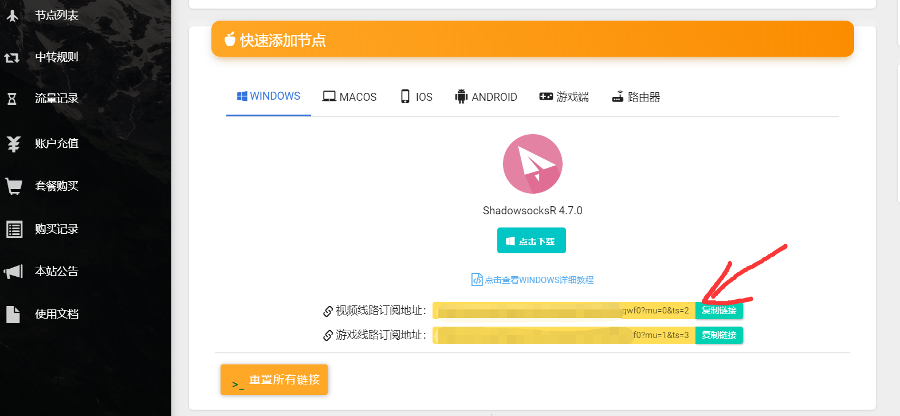
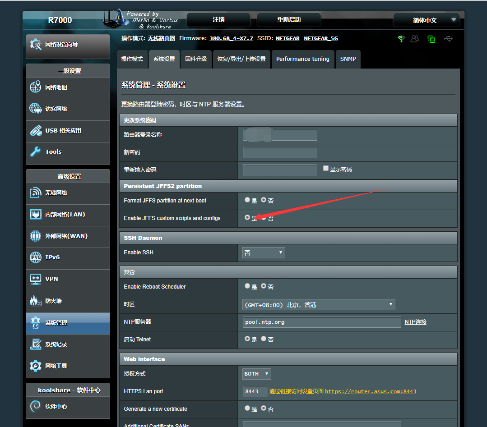
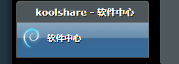
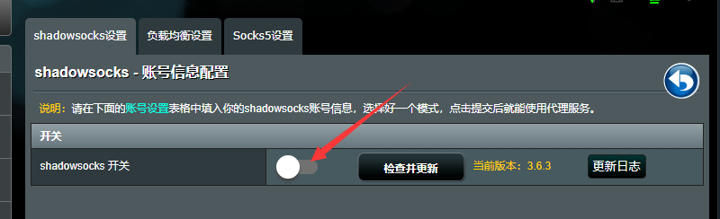
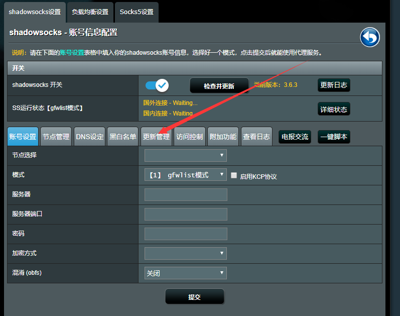
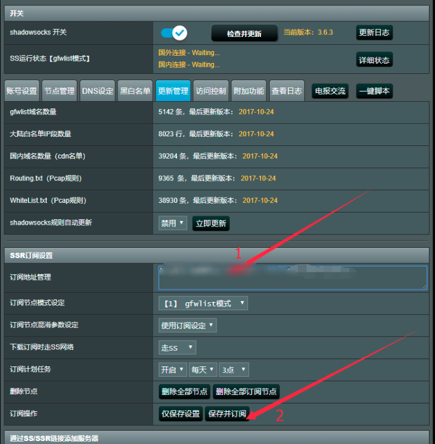
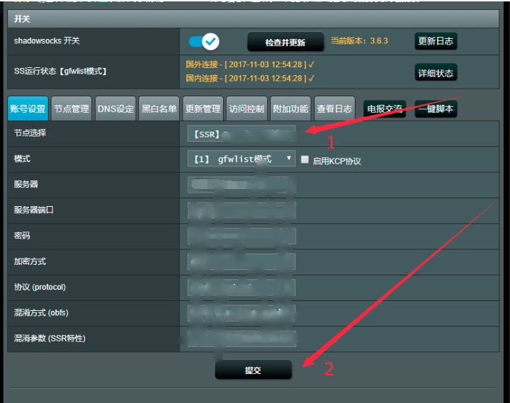

# 梅林固件 - SSR


 本文档仅为梅林固件提供教程。如果您是其他固件，可能操作不同，甚至没有订阅，没有订阅请[点击这里](/panel?id=手动获取配置)查看手动配置教程。实在不懂请点击右下角聊天按钮与我们取得联系。



 本文档为KoolShare改版固件，请大家将固件更新至最新版本改版固件再操作本教程，否则固件操作可能和本教程不一致


## 前言


在使用本站服务前，我们建议您保存好本站的联系方式，以防止与我们失联。


1. 地址发布页，建议收藏！地址：[http://ctfb.xyz](http://ctfb.xyz)
2. TG频道：[点击关注](https://t.me/cctcloud) （TG是一个国外通讯软件，需要翻墙，具体的教程[在这里](../../advanced/telegram.md)！\)
3. TG群：TG群仅允许VIP会员加入，购买会员后，在用户中心的用户须知可见！

## 节点配置

1.首先你要有一台刷好梅林的路由器（梅林的固件版本要在7.7以上，并且SS插件版本要在官方的3.6.3以上）

2.前往 CTCloud 用户中心复制订阅链接。


订阅链接可以在阁下之 [用户中心](https://www.tzct.xyz/user) 下方找到。


3.保证您的JFFS分区处于打开状态，打开后应重启路由器，打开方法如下图：  

4. 打开路由器登入界面，登入您的路由器，找到下图所示选项

5.进入SS配置界面，打开Shadowsocks，找到填写订阅的地方

6.将你刚刚已经创建的订阅地址复制粘帖到“订阅地址管理”里面然后点击“保存并订阅” 

7.选择您需要的节点和模式（各种模式的不同请见下文），点击提交  

8.提交后等待10秒左右，变成**国外连接\*\*** – **√**丨国内连接 **–** √**\*\*时就表示可以正常使用。**

## 模式介绍


简单说，我们推荐看视频用 **GFWlist模式** 或 **大陆白名单** ，玩游戏用 **游戏模式** 。具体介绍请见下文。




此模式下，插件仅会让国外被墙的网站通过代理，其余网站全部直连。

其优点为：不影响任何国内网站的使用且能够最大限度的节约流量。

其缺点为：访问国外的某个没有被墙的网站，不会通过代理，也就不会对其加速。而且GFWlist毕竟是人工制作的，不一定准确，可能某些被墙的网站也会直连而导致连接不上。



此模式下，所有国外网站全部通过代理，国内网站全部直连。

其优点为：不影响任何国内网站使用，且能够加速某些国外网站的访问速度。

其缺点为：由于全部国外网站都会被代理，可能导致流量消耗的骤增。对于某些对代理敏感的国外网站还可能引发不必要的麻烦。



访问国外网站走SS通道，国内网站全部直连，并且对部分游戏有优化增强。 游戏模式同样适用chnroute来区分国内外流量，如果你的游戏服务器是国外服务器，启用该模式后你的游戏将会走SS，如果是国内，那么就是直接连接。



此模式下，所有访问不管三七二一，访问的国内外的站全部从走SS通道使用代理服务流量，包括访问国内网站也走SS。一般不要选全局模式，全局不是全速，只会让你访问国内网站速度变慢，且大大加剧流量消耗。



如果您人在国外，想访问一些国内网站，用这个模式。本站暂不提供回国节点服务。



## 其他配置

### 手动更新订阅


在一些情况下（如网站节点更新，或您从免费账户升级至VIP后），您需要手动更新订阅，以获取最新节点。


点击上方菜单的**更新管理**，然后再点击**保存并订阅**按钮即可。

