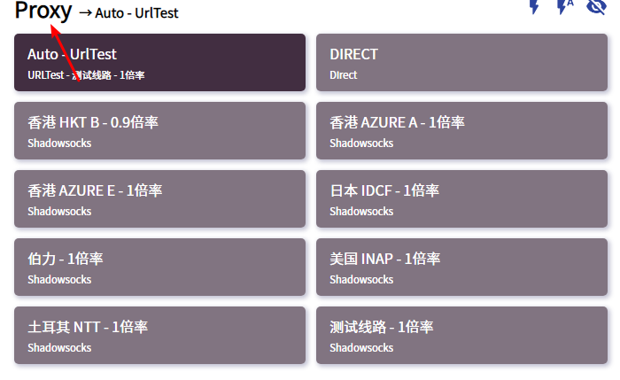

# Clash

## 前言


在使用本站服务前，我们建议您保存好本站的联系方式，以防止与我们失联。


1. 地址发布页，建议收藏！地址：[http://ctfb.xyz](http://ctfb.xyz)
2. TG频道：[点击关注](https://t.me/cctcloud) （TG是一个国外通讯软件，需要翻墙，具体的教程[在这里](../../advanced/telegram.md)！\)
3. TG群：TG群仅允许VIP会员加入，购买会员后，在用户中心的用户须知可见！

## 下载

点击下方进入Github项目页，下载安装文件（exe）



## 配置

1.前往用户中心下方，到**Clash托管**处点击 “复制链接”


托管链接获取教程请[点击这里](../../panel.md#ding-yue-lian-jie)


2.打开安装好的Clash，点击侧边的“**Profiles**”面板，然后将地址粘贴进如图所示位置，点“**download**”。

3.点击 **Proxies** 面板，点击最上方的“RULE”（global是全局，direct是直连），然后向下拉找到如图所示的“**proxy**”字段。选择“Auto-UrlTest”即代表自动选择最佳节点（具体自动选择的哪个您可以在上面的“Auto-UrlTest”字段看到。）。如您有自己的使用习惯，也可自行选择节点。


下方还有很多选项，包括Domestic，Others，Adblock等等。这些属于策略组，如果您感兴趣，可以[点击这里](../../advanced/rules.md)查看相关教程。请勿在看教程之前随意修改，否则可能出现问题！


4. 前往 **General** 面板，开启系统代理 system proxy，即可启动程序。Start with Windows是开机自启选项，我们建议开启。


此时您已经可以正常访问国际互联网了


5.此后您可在电脑右下角托盘找到它以随时切换配置。

## 其它

我们目前不确定 Clash 能否自动更新配置，如节点列表有更新（或您修改了密码），您可以手动更新配置。

