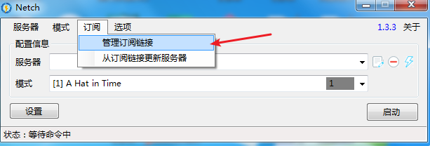
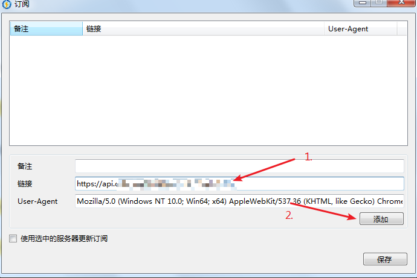
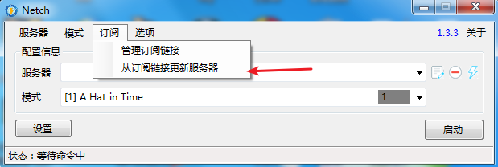
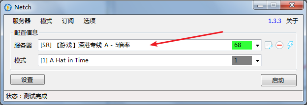
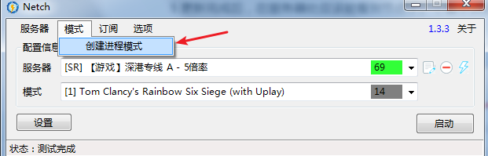
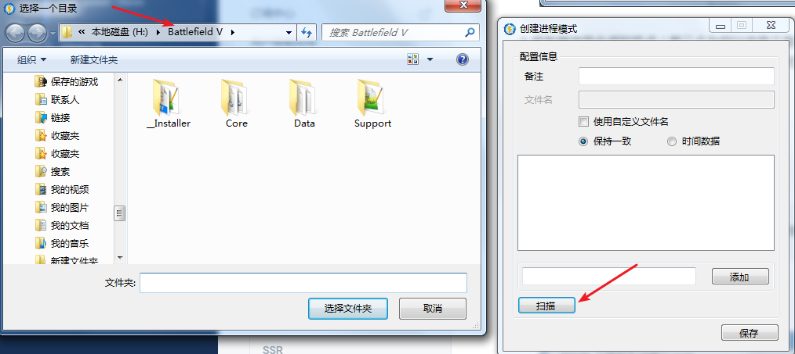
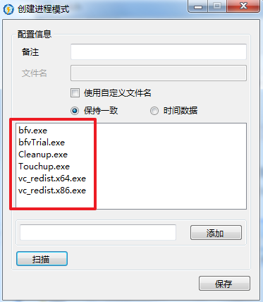

# Netch（游戏）

* 系统要求： Windows XP 以上
* 设备要求： Windows 计算机
* 软件要求： .NET Framework 4.0以上


本站仅允许付费用户使用游戏节点，如想使用请[点击这里](https://www.tzct.xyz/user)前往商店购买套餐！



本软件为新生软件，对比[SSTAP](sstap.md)，规则可能更好，还能解决NAT类型问题。但是根据反馈，该软件可能出现断线、游戏无法连接等现象，不够稳定。建议玩不看NAT类型的游戏使用[SSTAP](sstap.md)（例如R6，战地等）。


## 前言


在使用本站服务前，我们建议您保存好本站的联系方式，以防止与我们失联。


1. 地址发布页，建议收藏！地址：[http://ctfb.xyz](http://ctfb.xyz)
2. TG频道：[点击关注](https://t.me/cctcloud) （TG是一个国外通讯软件，需要翻墙，具体的教程[在这里](../../advanced/telegram.md)！\)
3. TG群：TG群仅允许VIP会员加入，购买会员后，在用户中心的用户须知可见！

## 软件下载

[点击这里进入](https://github.com/NetchX/Netch/releases)Github项目页，下载安装文件（exe，64位系统下载X64版本）

## 软件安装

您可以在上方下载Netch，解压安装完毕后打开软件即可。

## 导入节点

1.打开软件后，点击  订阅 --&gt; 管理订阅链接。

2.前往订阅中心获取**”游戏“**订阅链接。


订阅链接获取教程请[点击这里](../../panel.md#ding-yue-tuo-guan-lian-jie)


3.将复制的链接粘贴到**“链接”**处，备注填上（随意填），然后点添加，然后保存。

4.回到软件主页，点击：订阅 --&gt; 从订阅链接更新服务器。

5.更新完成后，在服务器处应该能看到节点了。（看不到多更新几次）

6.服务器选择合适的节点（前三个为网站信息不是节点），模式选择自己的游戏（如果看不到自己的游戏请继续向下看，下方会教你怎么制作模式，来支持任意游戏的加速！），点击启动即可。


此时您已经完成了全部配置，点击连接即可开启游戏加速之旅。



请注意，游戏节点禁止下载和科学上网等！


## 模式的创建


当软件自带模式没有您所需的游戏时，您可自行创建模式以支持任意游戏。


1.点击 模式 --&gt; 创建进程模式。

2.点击扫描按钮，然后浏览选择到您想添加的游戏根目录（如图我选择到了战地5的安装根目录，每个人的肯定是不一样的，自行寻找），进入后点击**选择文件夹**。

3.不出意外，Netch会自动扫描出需要代理的文件名称，完成添加（如有遗漏可自行添加，如果红框处没有名字代表目录选的不对）。确认无误后，备注填写一下（其实就是模式名，可以就写游戏名称就好，方便选择），最后点击保存。

4.然后，您就可以在模式中看到并使用您刚才所自定义添加的模式了。

### 手动更新订阅教程


在一些情况下（如网站节点更新，或您从免费账户升级至VIP后），您需要手动更新订阅，以获取最新节点。


软件主页，点击：订阅 --&gt; 从订阅链接更新服务器。

