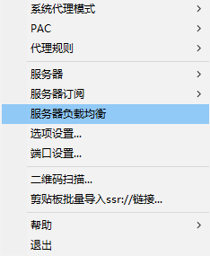
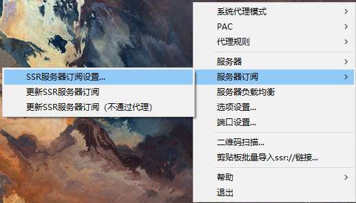
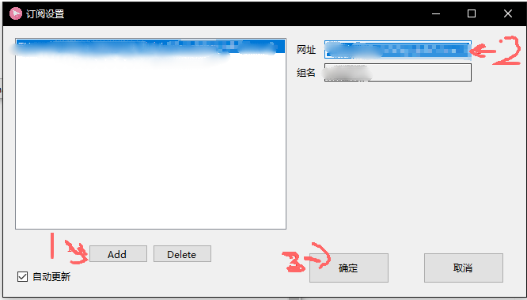
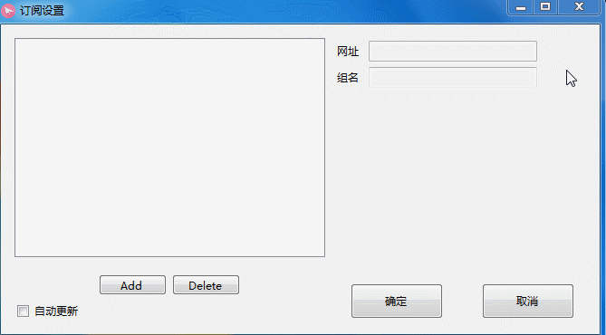
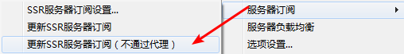
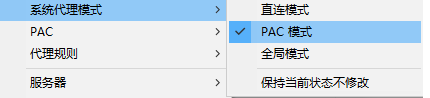
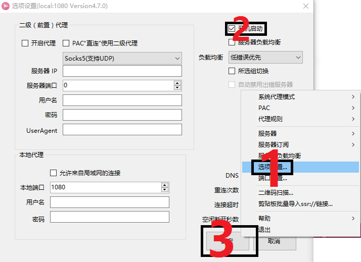

# SSR

* 系统要求： Windows XP 及以上
* 设备要求： Windows 计算机


本软件不能加速游戏，游戏加速请[点击这里](sstap.md)查看相关教程


## 前言


在使用本站服务前，我们建议您保存好本站的联系方式，以防止与我们失联。


1. 地址发布页，建议收藏！地址：[http://ctfb.xyz](http://ctfb.xyz)
2. TG频道：[点击关注](https://t.me/cctcloud) （TG是一个国外通讯软件，需要翻墙，具体的教程[在这里](../../advanced/telegram.md)！\)
3. TG群：TG群仅允许VIP会员加入，购买会员后，在用户中心的用户须知可见！

## 软件下载

* 蓝奏云：[点击这里下载](https://www.lanzous.com/i3s6yab)
* 腾讯微云：[点击这里下载](https://share.weiyun.com/58rSZHv)


以上的自动安装包无法使用？您可以[点击这里下载](https://www.lanzous.com/i3wzd4h)压缩包进行手动解压安装。

解压完成打开 **ShadowsocksR-dotnet4.0.exe** 即可。


## 软件安装

1. 您可以在上方找到**ShadowsocksR**客户端的下载链接，下载完毕后，打开进行安装。
2. 安装完成后，在桌面找到ShadowsocksR，双击打开，即可在任务栏中看到如图所示的**小飞机图标**（颜色会因配置不同而改变）。 


对于windows XP 用户，如果无法运行，请手动到ssr的安装目录，打开ShadowsocksR-dotnet2.0.exe即可。


## 负载均衡


郑重提醒：安装完第一步，右下角托盘的小飞机，右键，将负载均衡关闭！默认处于开启状态。请务必关闭，否则将可能会导致断线，风控，各种流媒体无法使用，严重还会导致账号被封！


## 导入节点设置

1.在小飞机图标上单击右键。

2.选择\[服务器订阅\]。

3.选择\[SSR服务器订阅设置\]。

4.完成以上步骤后将出现如图所示的对话框：

5.前往订阅中心获取”**视频“**订阅链接。


订阅链接获取教程请[点击这里](../../panel.md#ding-yue-tuo-guan-lian-jie)


6.将订阅链接填入软件。具体操作如下：


此处请注意，请**严格按照**以下步骤操作，不可更换操作顺序，否则会添加失败！！！



再墨迹一次，**请严格按照步骤操作**，下面还有动图！不然肯定添加失败！！！


* 单击\[Add\]按钮。
* 删除\[网址\]栏自带的默认网址。
* 复制本站的**订阅链接**到\[网址\]。
* 勾选\[自动更新\]，点击\[确认\]按钮。

7. 右键小飞机图标，点击\[服务器订阅 ---&gt; 更新SSR服务器订阅（不通过代理）\]，是不通过代理的选项请注意！！！点击后等待出现 SSR服务器订阅更新成功 即可。


如出现 **SSR服务器订阅更新失败** 请[点击这里](../../other/faq.md#windows)获取解决方案。



如果您之前没有使用过该软件，请继续向下看来配置软件。

强烈建议全看完。。。。。。。。。。。


## 软件设置

> 此处为软件设置教程，在这里您可以设置 节点，系统代理模式，开机启动，负载均衡 等。如果您曾经使用过ShadowsocksR软件，可以选择跳过该部分。

### 节点选择


要开始使用，首先您要选择您想使用的节点。我们的节点遍布全球各地。而对于不同地区，不同运营商的用户，各个节点的速度，延迟不一致，您需要自行找到最适合您的节点。


1. 右键**小飞机图标**。
2. 选择\[服务器\] --&gt; \[xxxxx-xx线路\]
3. 选择您喜欢的节点即可。

### 系统代理模式

您可以右键**小飞机图标**，点击\[系统代理模式\]来设定它。

系统代理模式分为3种：

1. 直连模式
2. PAC模式
3. 全局模式

我们将在下方对各个模式进行介绍。


我们推荐**PAC模式**（懒得看的就直接选吧）。




**直连模式**将不代理任何系统应用，只启用自带的socks5本地代理。具体参数您可以在\[选项设置\]中查看。适用于高端用户（小白就不要弄了）。



**PAC模式**将根据您访问的服务器所在地理位置自动分流，如访问的服务器在国内则不通过**ShadowsocksR服务** 直接连接，服务在国外则通过**ShadowsocksR服务**连接。该项设置可帮助您提高页面访问速度并且节省**ShadowsocksR**流量。



简单粗暴，不管您在运行什么软件，访问什么网站，全部通过**ShadowsocksR服务** 进行连接。**注意！！**该选项会使国内网站访问速度减慢且大大加剧流量消耗，谨慎使用！




至此您应该可以上网了。



配置完成还是不能上网？请[点击这里](../../other/faq.md#windows)获取解决方案。


### 自动运行

开机启动会使ShadowsocksR服务在您登陆系统后自动运行（非必要但推荐）。

1. 右键**小飞机图标**。
2. 选择\[选项设置\]。
3. 勾选\[开机启动\]。
4. 点击\[确定\]按钮。（此时您可能需要同意UAC权限）

### 手动更新订阅


在一些情况下（如网站节点更新，或您从免费账户升级至VIP后），您需要手动更新订阅，以获取最新节点。


1. 右键**小飞机图标**。
2. 点击\[服务器订阅 ---&gt;  更新SSR服务器订阅**（不通过代理）**\]，等待成功消息即可。


如出现 **SSR服务器订阅更新失败** 请[点击这里](../../other/faq.md#windows)获取解决方案。


