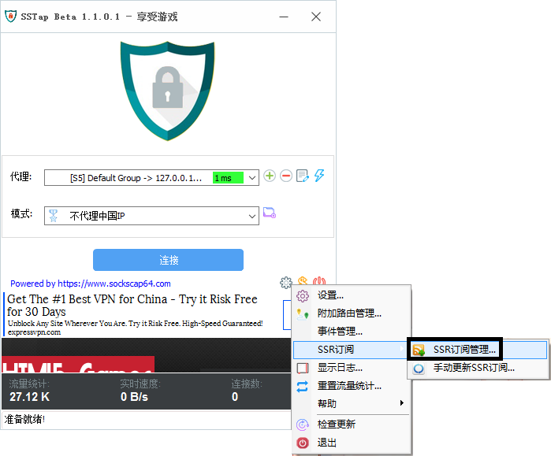
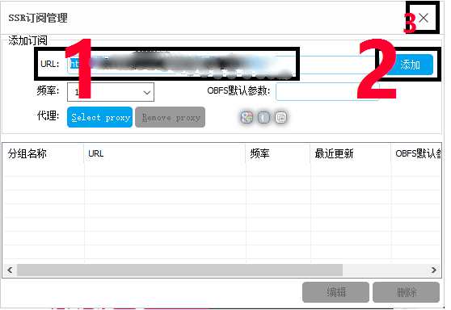

# SSTAP（游戏）

* 系统要求： Windows XP 以上
* 设备要求： Windows 计算机
* 软件要求： .NET Framework 4.0以上
* [点此下载软件安装包](https://share.weiyun.com/5sZtorP)


本站仅允许付费用户使用游戏节点，如想使用请[点击这里](https://www.tzct.xyz/user)前往商店购买套餐！


## 前言


在使用本站服务前，我们建议您保存好本站的联系方式，以防止与我们失联。


1. 地址发布页，建议收藏！地址：[http://ctfb.xyz](http://ctfb.xyz)
2. TG频道：[点击关注](https://t.me/cctcloud) （TG是一个国外通讯软件，需要翻墙，具体的教程[在这里](https://doc.tzct.xyz/telegram)！\)
3. TG群：TG群仅允许VIP会员加入，购买会员后，在用户中心的用户须知可见！

## 软件安装

您可以在上方下载SSTAP，解压并安装完毕后打开软件即可。


第一次运行时，系统会弹出是否允许虚拟网卡，请一定要点**允许**。


## 导入节点

1.点击右下角\[设置\]-\[SSR订阅\]-\[SSR订阅管理\]

2.在窗口中将`游戏线路订阅地址`粘贴到 URL 栏并点击添加，然后关闭窗口。此时软件将会自动更新订阅链接，完成后您可以看到节点。


订阅链接可以在阁下之 [用户中心](https://www.tzct.xyz/user) 下方找到。



刷新完毕后看不到游戏节点？[点击这里查看解决方案](https://doc.tzct.xyz/faq#windows)


3.选择合适的游戏线路,模式选择 **不代理中国IP** 


关于模式选择：不代理中国IP模式是万能的，可以加速全部外服游戏。选择其他模式反而容易出问题。



此时您已经完成了全部配置，点击连接即可开启游戏加速之旅。



请注意，游戏节点禁止下载和科学上网等！



 配置完成后连不上？出现错误？[点击这里](https://doc.tzct.xyz/faq#windows)查看解决方案！


### 手动更新订阅教程


在一些情况下（如网站节点更新，或您从免费账户升级至VIP后），您需要手动更新订阅，以获取最新节点。


右键电脑右下角托盘中的sstap图标（小盾牌），选择【SSR订阅 --》手动更新SSR订阅】，等待刷新完毕即可。

