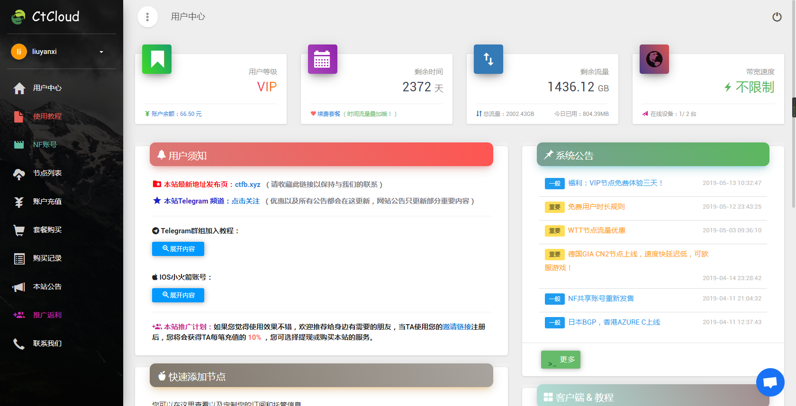
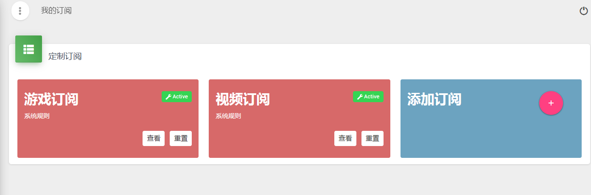
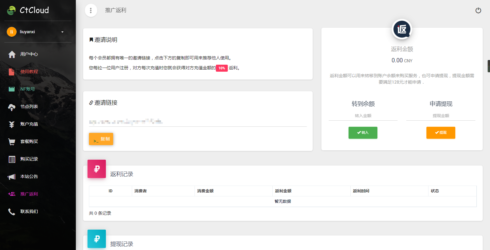
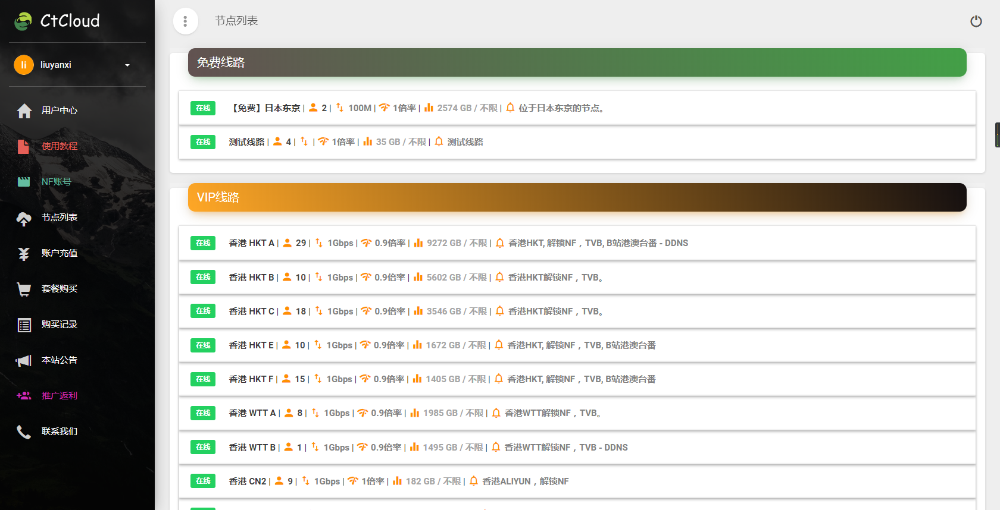
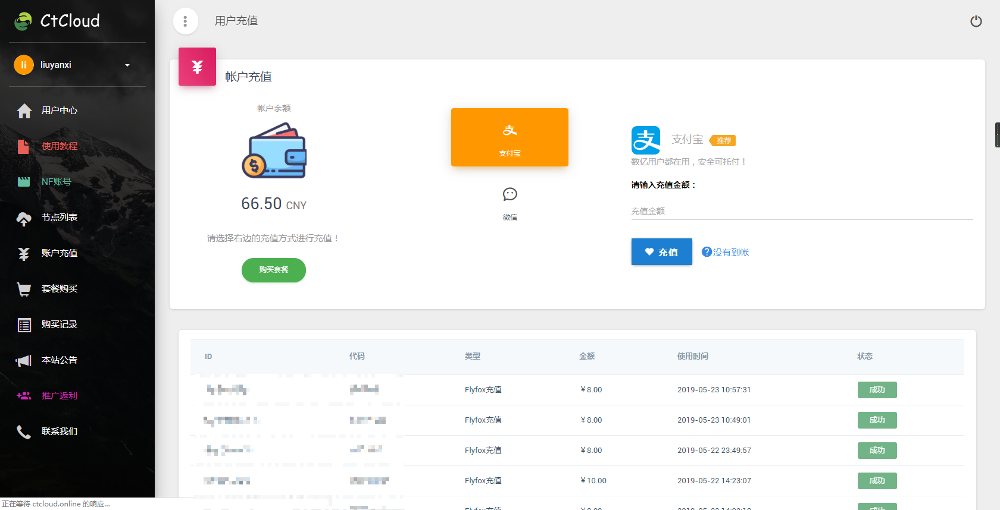
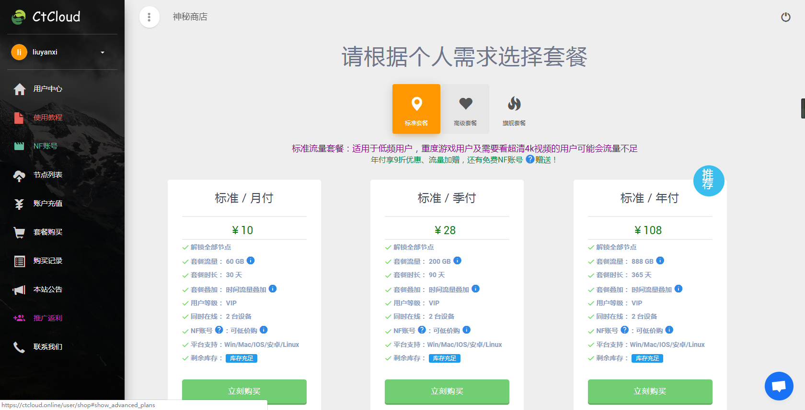
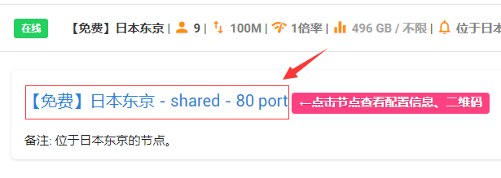
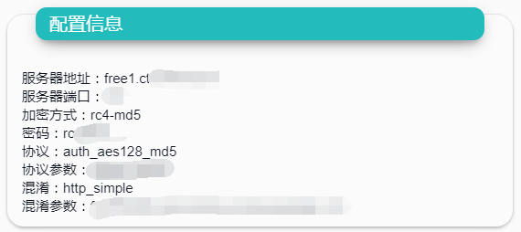

# 用户面板向导

## 登陆用户面板


我们推荐使用现代化浏览器，否则可能会导致元素显示错误。


## 订阅 / 托管链接

请您妥善保存您的订阅 /托管 链接，它和您的密码一样重要。

它们可以在阁下之订阅中心找到。

点击下方前往订阅中心（在网站左侧菜单也可见）：

在此，您可以选择视频订阅和游戏订阅进行查看。

当然，您也可以添加订阅，来定制属于您的订阅链接。相关的教程，请点击下方查看。




注意：游戏订阅仅适用于[SSTAP](basic/windows/sstap.md)进行游戏加速使用，其他软件适配不做保证。


另外，您还可以通过TG机器人获取订阅。具体请查看[Telegram教程](advanced/telegram.md#zai-telegram-zhong-shi-yong-ben-zhan-de-fu-wu)

## 邀请好友

您将可以通过我们的 [返利系统](https://www.tzct.xyz/user/invite)（Affiliates）邀请好友使用服务并且获得返利。您只需复制您的邀请链接给您的好友进行注册，当您的好友充值时，您都会受到其充值数值的15%返利。

## 节点列表

> 您可以在此获知本站所拥有的所有节点。如何获知配置信息以及如何手动配置请[点击这里](/panel?id=手动获取配置)

## 充值&购买套餐

我们提供免费线路，如果觉得效果拔群,请进入商店购买套餐赞助。

* **充值**

我们目前提供微信和支付宝这二种支付方式。您可以自行选择。

* **购买套餐**

阁下可以进入商品页面进行套餐选择。

## 手动获取配置

> 在不支持订阅的设备、软件中，您只能使用手动配置来试用本站的服务。这是有缺点的：您一次只能获取一个节点，且不能自动更新节点配置，您必须经常检查自己的配置是否已经过时，否则将不能使用。所以本站的默认教程都是推荐使用订阅进行配置。


本站使用 **SSR** 协议，请确认您的设备支持。如果缺少混淆和协议选项代表您的设备不支持SSR协议或者协议选择错误。


1.登录本站进入用户中心，在左侧菜单找到： **节点使用 -&gt; 节点列表** （或[点击这里](https://www.tzct.xyz/user/node)进入）

2.点击您想添加的节点，再点击如图所示之位置，查看节点配置信息。

3.节点配置信息如图所示。将配置手动一项项手动填入软件即可（建议复制否则可能出错）。您还可以在此界面下拉，以获取ssr链接以及配置二维码。

## 联系我们

目前，您有三种方式与本站取得联系：

1. 点击网站右下角聊天图标
2. 通过Telegram，私聊联系客服 [@ctcloud\_bot](https://t.me/ctcloud_bot)
3. 加入Telegram群（只有VIP会员能加入，加入群组教程，Telegram使用教程请[点击这里](advanced/telegram.md)）

